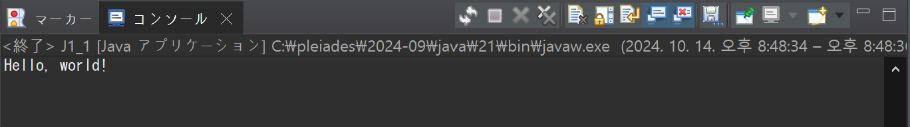
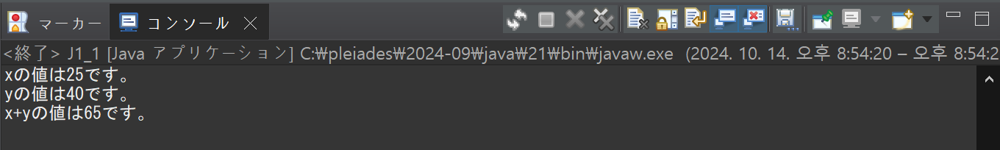
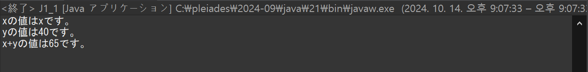

# プログラミング演習II 第01回
* 学籍番号：2364902
* 氏名：金　奎碩
* 所属：情報工学EP

# 課題の説明

## Hello world
### プログラムの説明
System.out.printlnを利用して"Hello, world!"を表示するプログラム。
### 実行結果

### 考察
C言語とは違いprintfではなくSystem.outを書く必要がある。

また、printではなくprintlnという“ln”が追加的に必要である。

## J1_1
### プログラムの説明
変数ｘとｙを宣言して各自25と40を入れてｘの値の出力ｙの値の出力してｘとｙの足し算の結果を出力するプログラム
### 実行結果
#### 通常の実行結果

#### ""を加えた実行結果

### 考察
Javaではprintlnで変数の値を入れるためには各自個別的に出力することであると思う。

System.out.println("xの値は" + x + "です。");は

System.out.println("xの値は");

System.out.println(x);

System.out.println("です。");

の三つのコードを＋で結んだことであると思う。

実際にSystem.out.println("xの値は" + x + "です。");をSystem.out.println("xの値は" + "x" + "です。");に変えるとxは変数ではなくそのままｘの文字を出力することで＋は三つのコードを繋ぐ演算子であると考えられる。

# 参考文献
特になし

# 謝辞
特になし

# 感想など
特になし
