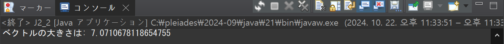
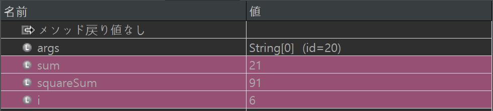

# プログラミング演習II 第02回
* 学籍番号：2364902
* 氏名：金　奎碩
* 所属：情報工学EP

# 課題の説明

## 課題1
### プログラムの説明
int型の配列｛2,5,3,8,9,7,6,1,4,10｝を宣言して、全ての要素の合計を計算する。
### 実行結果

### 考察
繰り返しループ計算はC言語と同じくfor文を利用することができる。また、C言語のfor文と同じ使い方である。

C言語でもfor文はセミコロン（；）を利用して三つの部分に分けている。最初の部分はインデックスの初期化である。次の部分がループの条件。最後の部分がインデックスの変化の形を宣言している。

JAVAもfor文の形を見るとC言語と同じである。違う点は配列の最後の確認の仕方である。

C言語では配列の最後であるNULLであるか違うかを確認することでループの計算ができる。しかし、JAVAの場合NULLがないため、.lengthを利用して配列の長さを利用してループの計算を行っている。

よって、配列を宣言すると最後にNULLを入れてメモリ空間を確保するC言語とは違いJAVAは宣言した長さのメモリ空間を確保すると考えられる。

## 課題2
### プログラムの説明
配列をdouble型のnew演算子で宣言してx,y,zを{3,4,5}の値で代入して、そのベクトルの大きさを計算するプログラム。
### 実行結果

### 考察
Javaでは、C言語のようにメモリ管理を意識してポインタを操作する必要はなく、new演算子を使って動的にメモリを確保することができる。例えば、double[] vector = new double[3];は、3つの要素を持つdouble型の配列を作成し、そのメモリが自動的に管理されると考えられる。

また、ベクトルの大きさ（ノルム）を求める際には、JavaではMath.sqrt()関数を使うことで平方根を簡単に計算でき、C言語で行うような数学ライブラリのインクルードが不要である。このように、Javaはメモリ管理や数値計算の手続きがC言語よりも高レベルに抽象化されており、より簡潔なコードで同じ結果を得られることができる。

## 課題3
### プログラムの説明
モンテカルロ法を用いて、半径1の円の面積から円周率（π）を求める方法を実装する。まず、Math.randomを使用して0から1の範囲の乱数を(x, y)として1000組生成する。それらの点が半径1の円の中にあるかを判定し、その割合を計算する。この割合から4分の1の円の面積が求められるため、4倍して円全体の面積、つまりπの値を推定する。さらに、求めたπの値とJavaのMath.PIと比較し、誤差をパーセンテージで出力する。また、乱数の数を変えることで、推定されるπの値がどのように変化するかを確かめる。
### 実行結果

### 考察
この方法では、半径1の円を考え、その面積は理論上πに等しいことを前提としている。モンテカルロ法では、ランダムに生成した点が円の中にある確率を利用して面積を推定し、そこからπの値を導く。乱数の組数を増やすほど、推定されたπの値はより正確になると考えられる。実際に乱数の数を増やしながら誤差が減ることを確認したいと思う。

#### 乱数の数１００

#### 乱数の数１０００

#### 乱数の数１００００

#### 乱数の数１０００００

#### 乱数の数１００００００００

このように乱数の数を増やすとπに近づくことがわかる。乱数の組数を増やすほど、推定されたπの値はより正確になる。

## 課題4
### プログラムの説明
ループを用いて整数1から10までの和と二乗和を計算する。プログラムを実行する際に、forループの中にブレークポイントを設定し、ループごとに変数の値を確認しながらデバッグ機能を活用して進める。デバッグ機能を使用することで、各ループの実行中に和と二乗和がどのように変化していくかを逐一確認しながら、プログラムの動作を確認する。
### 実行結果
#### 0回目のループ

#### 1回目のループ

#### 2回目のループ

#### 3回目のループ

#### 4回目のループ

#### 5回目のループ

#### 6回目のループ

#### 7回目のループ

#### 8回目のループ

#### 9回目のループ

#### 10回目のループ
  
### 考察
JAVAのデバッグ機能を利用して確認したいところをブレークポイントをして変数の変化を確認することができる。

よって、デバッグ機能を利用して和と二乗和を比較することができた。

和と二乗和の比較なのでループの最初は大きいな違いはないがループするたびに和と二乗和の違いははっきり見えるようになった。

# 参考文献
特になし。

# 謝辞
特になし。

# 感想など
C言語とJAVAの違いをわかるようになった。また、モンテカルロ法を利用してπの値を予測することができた。

そして、JAVAのデバッグ機能を使いこなせることができた。
