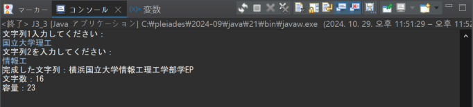

# プログラミング演習II 第３回
* 学籍番号：2364902
* 氏名：金　奎碩
* 所属：情報工学EP

# 課題の説明

## 課題1
### プログラムの説明
コマンドライン引数に入力した数字10進数を各2進数、16進数を出力するプログラムである。この際、Integerクラスのメソッドを利用する。
### 実行結果

### 考察
コマンドライン引数として入力した10進数の引数は20である。この時実行結果を確認すると10100(2)、14(16)である。

この結果が正しいか実際の計算を行って確認したいと思う。

20 / 2 = 10 ... 0

10 / 2 = 5  ... 0

5 / 2 = 2   ... 1

2 / 2 = 1   ... 0

よって、10進数である20を2進数に変えると10100になることがわかる。この結果は実行結果の結果と同じであるため正しく2進数を出力することができたと思う。

また、10進数である20を16進数に変えると
20 / 16 = 1 ... 4

この結果からわかるように20を16進数に変えると14になることが分かる。よって、Integerメソッドを利用して正しく他の進数に出力することができると思う。

## 課題2
### プログラムの説明
コマンドラインに計算式を入力してその結果を出力するプログラムである。

例えば、10 X 10のように二つのdouble型数字と、X、＋、ー、/の演算子を利用して計算結果を出力する。
### 実行結果

### 考察
コマンドラインは配列の形で保存されるので０番目の空間に一つ目の数字が入って1番目のメモリにchar型の文字が保存され、2番目のメモリに二つ目の数字が保存されると思う。

よって、double型の変数を宣言してコマンドラインの０番目のデータを入れる。

そして、1番目のデータは文字なのでchar型で宣言して保存する必要がある。

switchの使い方はC言語と同じ形なので問題ない。

しかし、割り算の計算を行う上で重要な０を割ることができないのでそれに注意してコードを書く必要がある。

もし、０で割ると次のような結果が得られる

この結果を見ると単純にエラーメッセージが表示されることではなく"Infinity"が出ることでJavaの計算は数学的に計算を行うことが分かる。

## 課題3
### プログラムの説明
最初にStringBufferクラスのオブジェクトを初期値「横浜学部学EP」で作成する。その後、キーボードから「国立大学理工」と「情報工」または「数理科」の2つの文字列を入力する。次に、それぞれの入力文字列を「学」の前に挿入し、最終的に「横浜国立大学理工学部情報工学EP」または「横浜国立大学理工学部数理科学EP」の形に文字列を完成する。最後に、完成した文字列とその文字数、StringBufferの容量を出力する。
### 実行結果

### 考察
sb.insert(2, str1)の部分を見るとstr1の文字列をsbの２の部分に入れることである。

この際２の位置の定義について調べたいと思う。

基本的にプログラミングでは文字列は配列として扱うので２の位置は配列のインデックスの数字を表すことであると思う。

よって、２を入力する理由は横浜学部学EPの文字列の横浜の次にstr1の文字列を入れたいことである。

配列の場合インデックスが０から始まるので２の位置は横浜の次のインデックスであることが分かる。

よって、sb.insert(2, str1)を実行するとsbの文字列が横浜学部学EPから横浜str1学部学EPになると考えられる。

そして、sb.insert(sb.indexOf("学") + 1, str2);を見るとsb.indexOf("学") + 1インデックスにstr2を入れることであるため”学”の文字が現れたインデックスに１を足したインデックスにstr2を入れることである。

よって、”学”の後ろに挿入することである。

結果的にsb文字列は横浜str1学部学EPから横浜str1学str2部学str2EPになることが分かる。

しかし、str1に”学”の文字が入っている場合はstr1が先にsbに挿入されているので”学”として認められstr2を挿入する。

従って、実行結果を見るとわかるようにstr1に国立大学理工を入力してstr2に情報工を入力して、str1に”学”の文字が含めているので横浜国立大学情報工理工学部学EPが出力されていると考えられる。

## 課題4
### プログラムの説明
まず初期値が{{11, 12}, {21, 22}}の2行2列の2次元配列aと、0で初期化された4行6列の2次元配列bを宣言する。その後、System.arraycopy()を用いてaの内容をbの指定された位置にコピーする。さらに、2つの配列を引数として取り、aの内容をbにコピーするメソッドと、1つの配列を引数にとって内容を表示するメソッドの2つの静的メソッドを作成する。出力ではSystem.out.printf()を用いて、数値が右揃えになるようにする。
### 実行結果

### 考察
System.arraycopy()の最後の引数であるa[i].lengthを利用する理由について考察したいと思う。

簡単にa = { {1, 2}, {3, 4} } に宣言した時に２を入力することで簡単に引数を書くことができる。

しかし、わざわざa[i].lengthを利用する理由は汎用的な方法で配列のサイズを確認しながら安全にコピー操作が可能である。

もし、2だけ書いたときに配列のサイズが変更したときに数字も変える必要がある。また、数字だけではその数字の意味が分からない可能性があるので可読性が落ちる。

よって、連動する数字は変数を利用して書くのが効率的である。

## 課題5
### プログラムの説明
「東京特許許可局許可局長」のStringオブジェクトを作成し、キーボードから1つの文字列を入力する。次に、その入力文字列が初期のStringオブジェクト内にいくつ含まれているかを数える静的メソッドを作成し、その数を出力する。
### 実行結果

### 考察
ここでtextの中にいるtargetの数を数えるコードは

    public static int countOccurrences(String text, String target) { //method to check how many target exsist in text 
        int count = 0;
        int index = 0;
        
        while ((index = text.indexOf(target, index)) != -1) {
            count++;
            index += target.length();
        }
        
        return count;
    }

である。しかし、この方法では前のインデックスから順番的に数えるのでもしｎ個の文字で構成されている文字列の場合時間複雑度はｎである。

よって、より効率的な方法として再帰的にtargetがあるか確認する方法がより効率的であると思う。

例えば、実行結果のように東京特許許可局許可局長の中に許の数を数える時に前から順番に確認するときは11個の文字が存在するので11回の計算が必要である。

しかし、東京特許許可局許可局長の11/2＝5.5≒6として＜可＞がtargetであるか確認する。そして、＜東京特許許＞と＜局許可局長＞を再帰的に各自確認する。詳しく次の図のような形で確認することができる。

このような方法を利用すると11回計算が4回の計算に収まることができる。しかし、このような方法は真ん中のインデックスを毎回探す必要があるし並列計算を行うことでたくさんのメモリを使う可能性がある。

しかし、たくさんの文字を含めた例えば１億個の文字を含めた文字列の場合はこのような方法が効率的である。

# 参考文献
特になし。

# 謝辞
特になし。

# 感想など
JAVAを使うことでだんだん慣れているように感じる。
