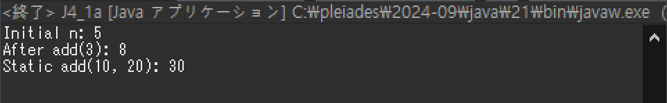
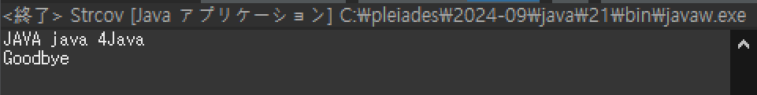
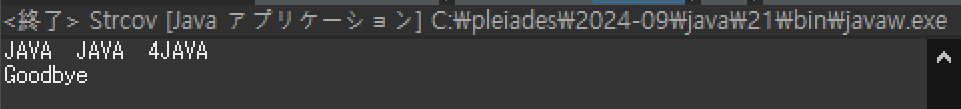
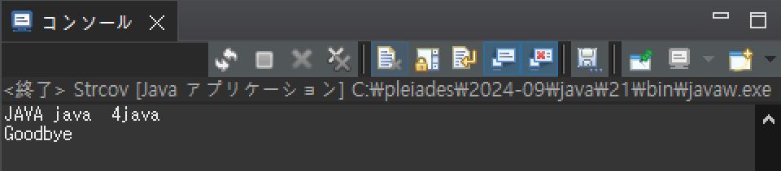
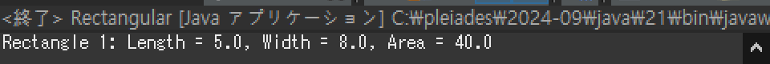
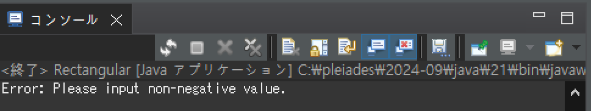
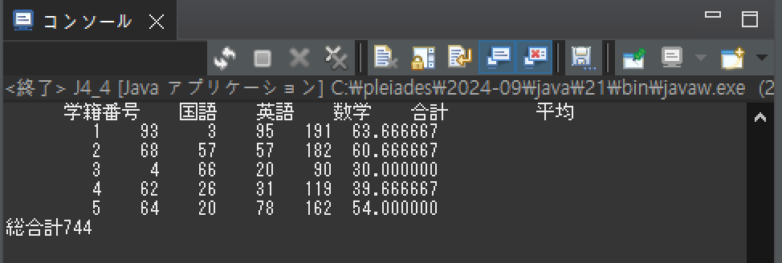

# プログラミング演習II 第04回
* 学籍番号：2364902 
* 氏名：金　奎碩
* 所属：情報工学EP

# 課題の説明

## 課題1
### プログラムの説明
整数の加算を行う AddInt クラスを作成し、int 型のインスタンス変数 n を初期化するコンストラクタ、n の値を返すインスタンスメソッド getN()、1つの引数を n に加算して結果を返すインスタンスメソッド add()、および2つの引数を加算して結果を返す静的メソッド add()（オーバーロード）を実装する。

さらに、main() メソッドで AddInt クラスのインスタンスを生成して各メソッドの動作を確認し、AddInt クラスを作成せずに別のクラス（例：J4_1a）内の main() メソッドだけで同様の処理ができることも確認する。
### 実行結果

### 考察
addメソッドで一つの引数を受け取る場合は予め決めておいたｎに引数を足し算を行うようになっている。

また、addメソッドを二つの引数を受け取った場合でオーバライドしたのでもしaddメソッドを呼び出す時に引数が一つであるか二つであるかによって違う結果を出している。

それを確かめるために2回addメソッドを呼び出している。

引数を3だけ入れた時と10,30を入れた時の実行結果を確認してお互い違う結果が出てることを確認する。

実行結果を見るとわかるように引数の数によって違う結果を返していることが分かる。

よって、二つの引数としてオーバライドしたときに引数の数で違う計算を行うことが分かった。
## 課題2
### プログラムの説明
Strcov クラスを作成し、静的変数 END（値は "Goodbye"）と静的メソッド toULCase() を実装する。

toULCase() メソッドは、引数の文字列の先頭が大文字なら全て大文字に、小文字なら全て小文字に変換し、どちらでもない場合はそのまま返す。

main() メソッドでは、コマンドライン引数に toULCase() を適用し結果を出力、引数が JaVa jAVA 4Java の場合に JAVA java 4Java Goodbye となるようにする。

引数の数が変化しても対応でき、また引数を "JaVa jAVA 4Java" のように "" で囲った場合の出力も確認する。

### 実行結果

### 考察
引数を "JaVa jAVA 4Java" のように "" で囲った場合の出力を確認して見るとこのような結果が得られる。

このような結果になる理由について考察したいと思う。

まず考えられる理由としては""で囲まれた部分すべてを文字列として認識していると考えられる。

もしJaVa jAVA 4Javaを一つの文字列として認識した場合一番前の先頭文字がJ大文字なので全ての文字が大文字になっていると考えられる。

このようなことを確認するために"JaVa" "jAVA 4Java"このように引数を入れて

JAVA java 4javaのような結果になると""で囲まれた部分すべてを文字列として認識していると考えられる。

よって、""で囲まれた部分すべてを文字列として認識しているので全ての文字が大文字になっている。
## 課題3
### プログラムの説明
四角形を表す Rectangular クラスを作成し、double 型の縦と横の長さをもつ2つのインスタンス変数を持たせることでする。

コンストラクタは、2つの引数で縦と横の長さを初期化するものと、1つの引数で縦の長さを初期化し横はデフォルト値10で初期化するものの2種類を用意する。

また、縦と横の長さを出力するメソッドと、四角形の面積を計算して返すメソッドを持たせます。Rectangular クラスを用いて、異なるコンストラクタを使って初期化された2つのインスタンスを生成し、それぞれの縦・横の値と面積を出力する。
### 実行結果

### 考察
ここで計算するのは四角形の計算なので変数の値は長さである。

長さは自然数であるため負数が入ることは望ましくない。

よって、try and catchを利用して変数に負数が入るときにエラーメッセージが出るようにコードを書いた。

もし、正しく自然数を変数に入れたら実行結果を見るとわかるように正しく実行結果を出力できる。

しかし、負数が入ったときは次のようなエラーメッセージを出力するようにした。

よって、正しく面積の計算ができると思う。
## 課題4
### プログラムの説明
「Test」クラスを作成し、学籍番号、国語、英語、数学の点数、および3科目の合計点を保存する5つのインスタンス変数を持たせ、4つの引数を受け取って初期化し、インスタンスメソッド「sum()」で3科目の合計点を求めるように設定する。

また、合計点を取得する「getSum()」、インスタンス変数5つを出力する「print()」、3科目の平均点を求める「average()」を実装する。

さらに、Testクラスの配列を受け取り総合計を算出するTotalクラスを作成し、静的メソッド「total()」で配列内の各インスタンスの合計点の総合計を返す。

mainメソッドでは5人分の「Test」インスタンスを学籍番号1〜5、3科目の点数を0〜100の乱数で初期化した配列として生成し、全員の学籍番号、各科目の点数、合計、平均点を表示した後、総合計を出力する。

また、0から100の整数乱数を生成する静的メソッド「static int ran()」を「J4_4」クラスに追加し、乱数生成を行う。
### 実行結果

### 考察
この課題では「Test」クラスと「total」クラスそして「J4_4」三つに分けて点数、合計、平均点を表示した後、総合計を出力している。

わざわざこのように、三つのクラスに分ける利点について考察したいと思う。

考えられる利点は役割分担の利点とコードのリサイクル性が増加する点である。

#### 役割分担
もし企業で大きなコードを作成する際に色んな部署から作られたコードを組み合わせる必要がある。

その時にこのような色んなクラスを利用して例えば、「Test」を担当する部署と「Total」を担当する部署を分けることで役割分担ができて仕事を並列的にこなすことができるため時間的に効率的である。

#### リサイクル性
「Test」、「Total」そしてJ4_4クラスを分けて定義することで他のプログラムやプロジェクトで簡単にリサイクル出来る。

例えば、「Test」クラスだけを使いたい時には「Test」クラスを独立的に持って来て使うことができる。

よって、新しくコードを書く必要なく時間を効率的に使うことができる。

# 参考文献
特になし。

# 謝辞
特になし。

# 感想など
コンストラクタとメソッドの概念がわかるようになった。
