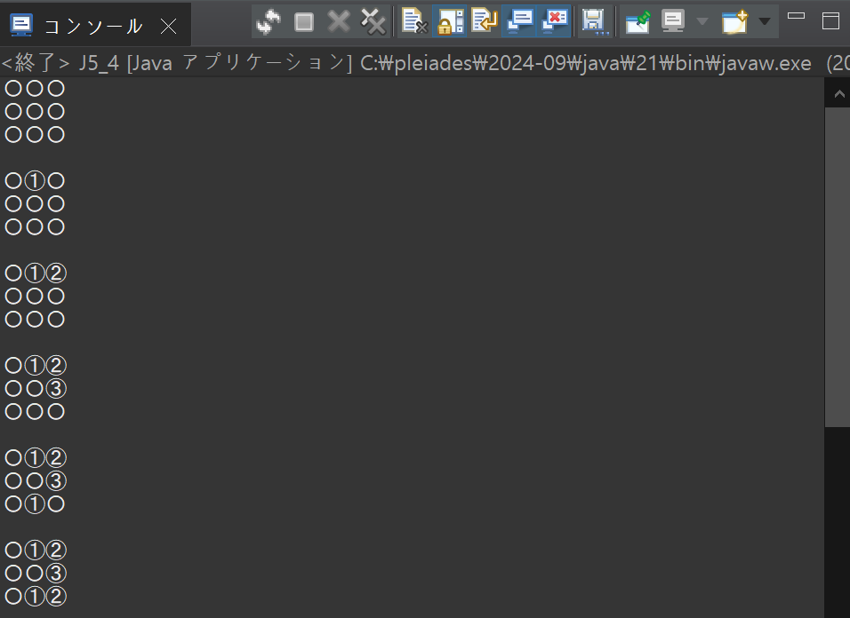

# プログラミング演習II 第05回
* 学籍番号：2364902
* 氏名：金　奎碩
* 所属：情報工学EP

# 課題の説明

## 課題1
### プログラムの説明
クラスの継承とメソッドのオーバーライドを用いて、基底クラス ClassA を継承する ClassB、さらに ClassB を継承する ClassC を作成する。

各クラスが自身のクラス名を表示する print() メソッドを持ち、サブクラスではスーパークラスの print() を呼び出した後に自身のクラス名を表示するようにオーバーライドする。

メインメソッドでこれらの結果を確認するとともに、エラーの発生原因を理解する。
### 実行結果

### エラー

### 考察
ClassC c = new ClassA();

c.print() ;

このようなコードを書いた時にエラー生じる理由について考察したいと思う。

まず、このコードで実行しようと思っているのはClassC cにClassAを代入しようと思っている。

ClassCはサブクラスである。また、ClassAはスーパークラスである。

よって、このコードはサブクラス型の変数にスーパークラスのインスタンスを代入しようと思っている。

しかし、Javaでは「スーパークラス型の変数にサブクラス型のインスタンスを代入すること（アップキャスト）」は許容されるが、その逆（ダウンキャスト）は特別な状況でしか許容されず、明示的なキャストが必要で、実行時に例外（ClassCastException）を引き起こす可能性がある​。

よって、エラーが生じた理由は明示的なキャスト無しでサブクラス型の変数にスーパークラスのインスタンスを代入（ダウンキャスト）しているのでエラーが生じたと考えられる。
## 課題2
### プログラムの説明
抽象クラス Light を作成し、その中に指示の文字列を保持する変数 str と、それを初期化するコンストラクタ、指示を出力する抽象メソッド print() を定義する。

その上で、Light を継承する Green、Red、Yellow の3つのサブクラスを作成し、それぞれのクラスで print() メソッドをオーバーライドして、Green is 指示、Red is 指示、Yellow is 指示 のように表示するよう実装する。

また、各クラスのオブジェクトを作成し、Green に "Walk"、Red に "Stop"、Yellow に "Caution" を設定して print() メソッドの動作を確認する。

さらに、抽象クラス Light の変数 str を private、protected、修飾子なし（デフォルト）の場合について、それぞれの影響を考察する。

### 実行結果

### 考察
抽象クラス Light の変数 str を private、protected、修飾子なし（デフォルト）の場合の結果を確認してその理由について考察したいと思う。

### private
#### 実行結果

### protected
#### 実行結果

### 修飾子なし
#### 実行結果

この実行結果からわかるようにprivateの時だけエラーが生じて他の場合は問題なく出力できた。

privateの場合エラーが生じる理由について考えたいと思う。

特に、他のクラスでstrを使うときに次のようなエラーが生じることが分かる。

ここで言っている不可視であることは見ることができない意味である。

よって、考えられる理由としてはLightクラスでprivateで宣言したのでLightクラスの中だけでアクセス制限されていると考えられる。

解説でも「同じクラスのコードからしかアクセスできない変数」と言っているので他のクラスのアクセスができないためエラーが生じたと考えられる。

## 課題3
### プログラムの説明
スーパークラス Circle を作成し、それを継承する Sphere（球）、Cylinder（円柱）、Cone（円錐）の3つのサブクラスを作成する。

Circle クラスには半径を保持する変数 radius、半径を初期化するコンストラクタ、円の面積を計算する getArea() メソッド、半径を取得する getRadius() メソッドを作成する。

Sphere クラスでは、半径を初期化するコンストラクタと球の体積を計算する getVol() メソッドを実装します。Cylinder クラスと Cone クラスには、高さを保持する変数 height、半径と高さを初期化するコンストラクタ、高さを取得する getHeight() メソッド、円柱・円錐の体積を計算する getVol() メソッドをそれぞれ作成する。

これらのクラスのインスタンスを1つずつ生成し、Circle では半径と面積、Sphere では半径と体積、Cylinder と Cone では半径・高さ・体積を出力する。体積計算の式が必要であれば、調べて作成する。
### 実行結果

### 考察
このコードでは一つのスーパークラスCircleに、半径を扱う基本的な機能を定義している。

その機能としてはradiusやgetRadiusやgetAreaのメソッドである。

このような機能（メソッド）は他の計算（Sphere, Cylinder, Cone)で使われる。

しかし、全ての計算でメソッドを初めから定義するのは時間的に無駄が多い。

また、メソッドを変更するとき全てのクラスのメソッドを変える必要がある。

よって、課題のようによく使われるメソッドをスーパークラスとして継承することでこのような無駄な作業がなくなるのでより効率的なコードを作ることができる。

## 課題4
### プログラムの説明
縦横3×3の9マスの盤面に、記号 '①'、'②'、'③' を交互にランダムな空きマスへ配置するプログラムを作成する。

まず、抽象クラス Board を定義し、盤面データを保持する静的フィールド char[][] board を用意する。

Board クラスには、盤面を全て '〇' に初期化する clear() メソッド、盤面を表示する print() メソッドを静的に定義し、さらに、記号を配置する抽象メソッド put() を持たせる。

次に、Board を継承する Computer クラスを作成し、記号を設定するコンストラクタと、空きマスをランダムに選んで記号を配置する put() メソッドを作成する。

Computer クラスのオブジェクトを3つ作成し、それぞれに '①'、'②'、'③' を割り当て、交互に記号を配置していき、配置後の盤面を都度表示する。
### 実行結果

### 考察
ComputerクラスでBoardを継承することで得られる利点が多いと考えられる。

特に、Boardクラスは共通的な機能であるボードの初期化（clear)と出力(print)メソッドを定義している。

このような機能はComputerクラスでも使えるのでComputeのクラスの中で動作を定義する際にボード関連のコードを重複して作成する必要がない利点がある。

# 参考文献
特になし。

# 謝辞
特になし。

# 感想など
JAVAを使うことでだんだん慣れているように感じる。
