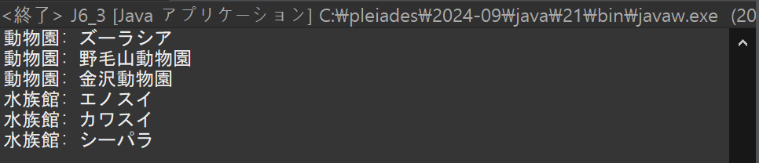

[](https://classroom.github.com/a/U1AjEWGS)
# プログラミング演習II 第06回
* 学籍番号：2364902
* 氏名：金　奎碩
* 所属：情報工学EP


# 課題の説明

## 課題1
### プログラムの説明
抽象クラス Light をインターフェースに書き換え、定数 {“Walk”, “Stop”, “Caution”} と抽象メソッド print() を定義する。インターフェースを実装する Green, Red, Yellow クラスで print() をオーバーライドし、それぞれ対応する文字列定数を出力する。また、インターフェース型の変数を用いて各クラスのオブジェクトを参照し、同じ結果が得られることを確認する。
### 実行結果


### 考察
前回の課題２の場合は抽象クラスを使用してLgithを設計している。それに比べて、今回の課題ではインタフェースLightを使用してクラス設計している。この抽象クラスとインタフェースの違いについて調べてみようと思っている。

解説にも述べられているように抽象クラスとインタフェースの違いは定数とabstractメソッド（抽象メソッド）しかメンバになれないことである。また、抽象クラスは1つのスーパークラスしか継承できないことに比べてインタフェースの場合複数のインタフェースを実装できる。

前回の課題２では抽象クラスであるLightをスーパークラスとして、各サブクラス（Green, Red, Yellow）が継承していた。この際に、抽象クラスを使用しているため1つの親クラスしか継承できない。もし、Green, Red, YellowクラスがLightクラス以外のクラスを同時に継承するとエラーが生じることである。

しかし、それに比べてインタフェースの場合は他のインタフェースも同時に実装可能である。よって、Lightとは別のインタフェースを同時に実装してもエラーが生じることはない。

例えば、他のインタフェースをOtherInterfaceとし定義して同時に実装する次のようにコードを加えて実行しても問題なく同じ結果が得られる。

```
interface OtherInterface {
    void otherMethod();
}

class Green implements Light, OtherInterface {
    @Override
    public void print() {
        System.out.println("Green is " + STATES[0]);
    }

    @Override
    public void otherMethod() {
        System.out.println("Other method in Green");
    }
}
```

## 課題2
### プログラムの説明
人とコンピュータが「じゃんけん」を行うプログラムである。

まず、"グー", "チョキ", "パー" を定数として持ち、じゃんけんの手を決定する play() メソッドを含むインターフェース Jyanken を定義し、このインターフェースを実装する Human クラスではキーボード入力に基づいて手を選び、Computer クラスではランダムに手を選ぶ。

また、静的メソッド judge() を持つ Judge クラスを作成し、じゃんけんの勝敗を判定し、main() メソッドでは、ユーザーに「何回勝つまでプレイするか」を入力させ、その回数勝つまで「じゃんけん」を繰り返す。

各ラウンドの結果（勝敗、選んだ手、累積成績）は都度表示され、ユーザーが指定した勝利回数に到達するとゲームが終了し、挨拶メッセージが表示するプログラムである。
### 実行結果


### 考察
ここではJyankenというインタフェースを定義してHumanクラスとComputerクラスがインタフェースを実装している。

そして、勝敗判定を行うクラスであるJudgeはインタフェースを実装する必要ないため普通のクラスで宣言している。

このプログラムではUserから数字を入力してもらってそれに応じてプログラムが回っている。

よって、Userがどのような数字を入れるか全ての条件で確認する必要がある。

例えば、0,1,2の数字ではなく-1や4など定義していない数字をUserが間違えて入力した時、この場合の処理を予め作ってないとプログラムが動かなくなる可能性がある。

最初には、0,1,2だけを入力すると仮定してコードを作ったがもしUserが他の数字を入力した時にどのようになるか確認してみたところプログラムはどのような数字を入れても動かなくなった。

そのように例外処理をして次のように例外の数字を入力した時に正しく数字を入力するよう例外処理を加えた。


よって、このようにUserから入力をもらうときは例外処理をはっきり決める必要があると思う。

## 課題3
### プログラムの説明
施設の種類（動物園と水族館）を管理し、名前を表示するプログラムである。

まず、施設名を保持する変数 name と、施設名を初期化するコンストラクタ、および施設の種類と名前を表示する抽象メソッド print() を持つ抽象クラス Facility を定義する。そして、この Facility を継承するクラスとして、動物園を表す Zoo クラスと水族館を表す Aquarium クラスを作成する。

それぞれのクラスで name を初期化するコンストラクタを実装し、print() メソッドをオーバーライドして、施設の種類と名前を出力する。

さらに、Facility 型の配列を作成し、動物園や水族館のオブジェクトを格納して、その配列をループで処理し、instanceof 演算子を用いてオブジェクトが動物園か水族館かを判定する。

動物園のオブジェクトを最初に出力し、その後に水族館のオブジェクトを出力する形式で結果を表示するプログラムである。
### 実行結果

### 考察
ここではクラスの特定の際に`instanceof`演算子を利用している。

instanceof演算子とは、オブジェクトが特定のクラスまたはそのサブクラスのインスタンスであるかを判定する機能を持っている。

ここでinstanceof演算子を利用することで得られる利点について考えたいと思う。

instanceof を使用することで、実行時にオブジェクトの型を動的に判定し、特定の型にのみ処理を適用可能である利点がある。

例えば、Zoo のみを対象に特別な処理を追加する場合でも、簡単に実現可能である点である。

そして、Facility 型の配列で Zoo と Aquarium を一括管理し、特定の型のオブジェクトに対する処理を instanceof を用いて動的に振り分けられる。

よって、動的な型判定により、特定の条件に応じた処理を容易に実現し、柔軟なプログラム構造を作ることができる。

## 課題4
### プログラムの説明
p パッケージと p1.p2 パッケージを作成し、それぞれのパッケージ内にクラスを作成します。p パッケージにはクラス ClassP を作成し、クラス名を出力する print() メソッドを実装する。

同様に、p1.p2 パッケージにはクラス ClassP1P2 を作成し、同じくクラス名を出力する print() メソッドを実装する。

次に、デフォルトパッケージに main() メソッドを持つクラス J6_4 を作成し、ClassP と ClassP1P2 のオブジェクトを生成し。それぞれの print() メソッドを呼び出してクラス名を出力するプログラムである。

そして、import 文を使用した場合と使用しなかった場合のコードを作成する。
### 実行結果


### 考察
main() メソッドを持つクラス J6_4 を作成し、ClassP と ClassP1P2 のオブジェクトを生成している。この際にimport文を使用している場合と使用していない場合のコードの違いとどのような違いがあるか考察したいと思う。ここではパッケージの中にあるクラスの内容は同じでJ6_4の内容だけ違うのでその二つを比較したいと思う。

#### import文がある場合
```
// クラスをインポート
import p.ClassP;
import p1.p2.ClassP1P2;

public class J6_4 {
    public static void main(String[] args) {
        // インスタンスを作成
        ClassP classP = new ClassP();
        
        // インスタンスを作成
        ClassP1P2 classP1P2 = new ClassP1P2();

        // メソッドの呼び出し
        classP.print();
        classP1P2.print();
    }
}
```
##### 実行結果

#### import文がない場合
```
public class J6_4_1 {
    public static void main(String[] args) {
    	
    	// 完全修飾名を使ってインスタンスを生成
        p.ClassP objP = new p.ClassP();
        // 完全修飾名を使ってインスタンスを生成
        p1.p2.ClassP1P2 objP1P2 = new p1.p2.ClassP1P2();

        // メソッドの呼び出し
        objP.print();
        objP1P2.print();
    }
}
```
##### 実行結果

#### 違う点
importを使用している場合と使用していない場合のコードを比較するとクラスの指定方法が違うことが分かる。

importを使用しているコードでは必要なクラスを明示的にインポートできる。それに比べて、import文を使用していないコードでは完全修飾名でパッケージを明示する必要があるのでClassPを呼び出す際にp.ClassPとしてパッケージを明示する必要がある。

#### 利点
多くのクラスを扱う場合は簡潔で読みやすいコードになるのでimport分を使用する方がいいと思う。

もし、パッケージの量が多くなるといちいち明示するとコードが長くなり読みづらくなる可能性が多い。

また、必要なクラスが多い場合import文を使用しないと毎回クラスを呼び出す際に完全修飾名でパッケージを明示する無駄な時間が要するのでimport 文を使用することが推奨される。

## 課題5
### プログラムの説明
ExtoString というクラスを作成する。このクラスは int 型の x と y の2つの変数を持ち、それらを初期化するためのコンストラクタを実装する。

また、Object クラスの toString() メソッドをオーバーライドし、System.out.println(obj); を実行した際に、オーバーライド toString x = 10 , y = 20 という形式でオブジェクトの情報を出力するプログラムである。

次に、この toString() メソッドをオーバーライドしない場合を確認し、toString() メソッドはデフォルトの挙動として、クラス名@ハッシュ値 の形式で出力する。

### 実行結果
#### オーバライドした場合

#### オーバライドしない場合

### 考察
ここではオーバライドした場合はreturnした```オーバライド toString x = 10, y = 20```が出力される。

それに比べて、オーバライドしていない場合は```ExtoString@1f021e6c```が出力される。

この違いが生じた理由について考察したいと思う。

ここでオーバライドしていないときに```ExtoString@1f021e6c```が出力される理由は全てのクラスが継承するObjectクラスにtoStrin()メソッドが含まれているからである。

Javaでは作成された全てのクラスに基本的にObjectクラスを継承する。よって、toString()を明示的に作成しなかった場合はObjectクラスに定義されているtoString()メソッドが呼び出されることである。

実際に、出力される```ExtoString@1f021e6c```を見るとクラスの名前と＠そしてハッシュ値が出力されることが分かる。

これはOracleで確認できるように
```
public String toString() {
    return getClass().getName() + "@" + Integer.toHexString(hashCode());
}
```
このようなメソッドが動作してオーバライドした場合とオーバライドしていない場合違う結果が得られると思う。

# 参考文献
Oracle「クラス Object」https://docs.oracle.com/javase/jp/7/api/java/lang/Object.html

# 謝辞
特になし。

# 感想など
インスタンス、instanceof演算子、パッケージ、import、Objectクラスについてわかるようになった。

