
# プログラミング演習II 第07回
* 学籍番号：2364902
* 氏名：金　奎碩
* 所属：情報工学EP

# 課題の説明

## 課題1
### プログラムの説明
整数の除算処理を通じて算術例外（ArithmeticException）の発生と処理を確認するプログラムである。

main() メソッドから a() メソッドを呼び出し、さらに a() から b() メソッドを呼び出す。b() メソッドでは、ユーザーから入力された2つの整数を用いて除算を行い、0で割る操作による例外を発生させる。

例外が発生した場合、catch ブロックでこれをcatchし、例外オブジェクトを利用してさまざまな方法で例外情報を出力する。また、finally ブロックを使用して、例外の有無にかかわらず必ず実行される処理を確認する。

さらに、プログラムの最後に "main：終了" を出力することで、例外発生後も正常にプログラムが終了することを確認するプログラムである。

### 実行結果
#### `e.printStackTrace();`の場合
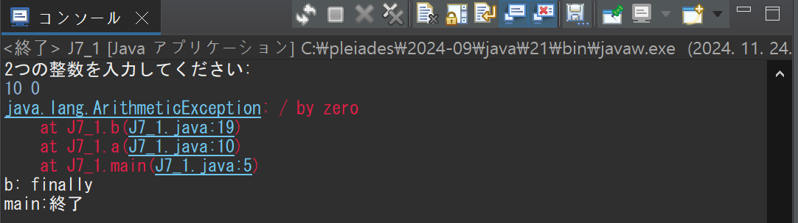
#### `System.out.println(e);`の場合
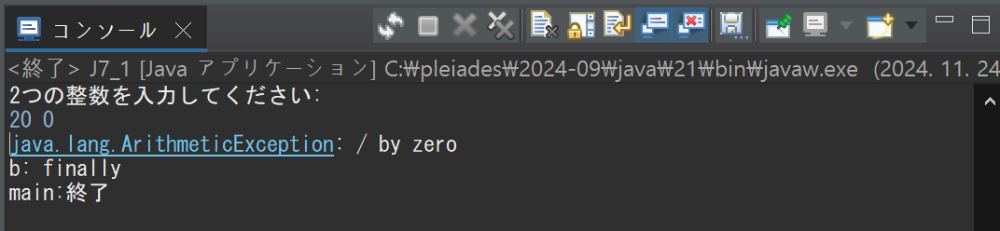
#### `System.out.println(e.getMessage());`の場合
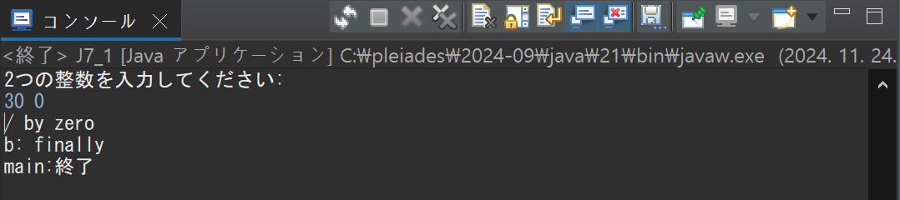
#### `System.out.println("0で割っています");`の場合
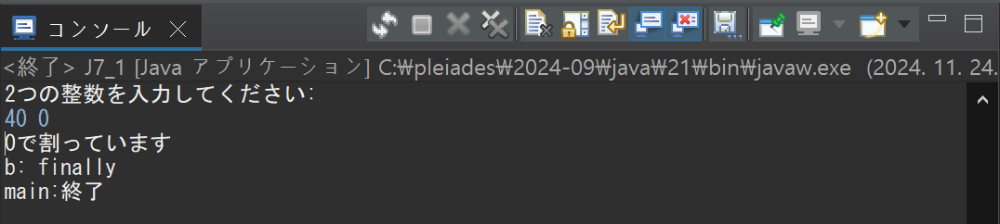

### 考察
各例外処理の違いと利点について考察したいと思う。

#### `e.printStackTrace()`
1. 内容

   発生した例外のスタック トレース（エラー発生パス）を出力する。
3. 利点

   デバッグに最適化：例外が発生したコードのファイル名、行番号、呼び出し経路などを確認することができ、例外の原因を追跡するのに非常に効果的である。
#### `System.out.println(e)`
1. 内容

   発生した例外オブジェクトのクラス名とメッセージを出力する。
3. 利点

    簡潔な情報提供：例外のクラスの名前と簡単なメッセージを含んでいるので、例外発生の原因を簡潔に確認できる利点がある。
#### `System.out.println(e.getMessage())`
1. 内容

    例外オブジェクトが含まれているメッセージの内容のみを出力する。
3. 利点

   ユーザーフレンドリー：例外の詳細なメッセージのみを出力するため、ユーザーに直感的な情報を提供することができる。
#### `System.out.println("0で割っています")`
1. 内容

   例外の発生時にカスタム メッセージを出力。
3. 利点

   ユーザー中心のメッセージ：例外を処理するコードで特定の状況を認識し、ユーザーフレンドリーなメッセージを提供できます。

## 課題2
### プログラムの説明
コマンドライン引数として整数を1つ受け取り、それを出力するプログラムである。

引数が提供されていない場合や、提供された値が整数に変換できない場合に例外を処理し、適切なエラーメッセージを表示する。

具体的には、引数がない場合には「引数がありません」というエラーメッセージを表示し、整数を入力するように求める。

また、引数が整数に変換できない場合には「int型ではありません」というメッセージを表示し、再度入力を促す。

例外が発生した場合でも、キーボードからの入力を受け付けて正しい整数を取得し、最終的にその値を出力する。

このプログラムは、例外発生時にエラー内容を適切に処理し、ユーザーが正しい入力を行うまで安全に処理を継続するプログラムである。
### 実行結果
#### 引数がない場合
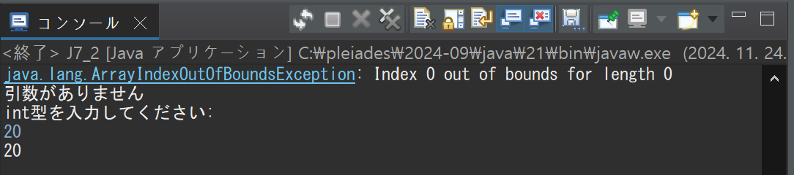
#### 引数がある場合
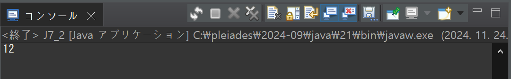
#### int型ではない場合
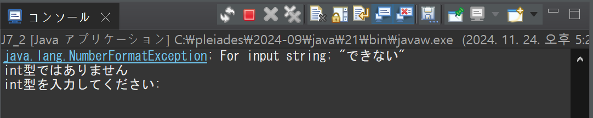

### 考察
try & catchで得られる利点について考察したいと思う。

考えられる利点としては明確な例外処理とプログラムの安全性向上が挙げられる。

#### 明確な例外処理
1. `ArrayIndexOutOfBoundsException`場合：`args[0]`が存在しないときに発生する例外である。コマンドライン引数がない場合ユーザーに`"引数がありません"`のメッセージを出力してユーザーからの入力を要求する。
2. NumberFormatException場合：`args[0]`が整数に変換できない値の時に発生する例外である。ユーザーに`"int型ではありません"`のメッセージを出力し、ユーザーからの正しい値の整数の入力を要求する。
#### プログラムの安全性向上
try&catchは例外発生を予め予測して、例外が発生してもプログラムが急に停止することなく正常的に実行できる。

例えば、この課題のようにユーザーから正しい引数が提供されないときにプログラムを止めることではなくユーザーに正しい入力を要求することができる。

## 課題3
### プログラムの説明
このプログラムは、銀行口座をシミュレーションするもので、預入、引出、残高照会、終了の操作を行うメニュー形式のプログラムである。口座の残高は BankAccount クラスのプライベート変数として管理され、初期値は 0 である。ユーザーは以下の操作を行うことができる。

1. 預入 (d): 預入金額を入力して口座に金額を追加する。金額が 0 以下の場合には例外が発生し、エラーメッセージが表示される。
2. 引出 (w): 引出金額を入力して口座から金額を引き出す。金額が 0 以下の場合や残高不足の場合には例外が発生し、エラーメッセージが表示される。
3. 残高照会 (g): 現在の残高を表示。
4. 終了 (e): プログラムを終了。
   
金額の入力時には、IllegalArgumentException を使用して不正な金額（0 以下や残高不足）に対して適切なエラーメッセージを表示する。

また、入力が整数型でない場合は再入力を求めることで、ユーザーが正しい操作を行えるようにする。

プログラムは、ユーザーが終了 (e) を選択するまで動作を続け、例外が発生してもエラー内容を表示して操作を継続できるよう設計されている。
### 実行結果
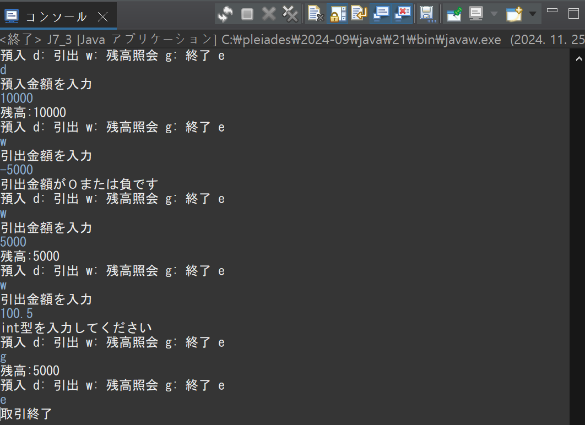
### 考察
このコードではユーザーから入力をもらうたびに`scanner.nextLine();`を入力する必要がある。

この理由としては「入力バッファーに残ってる改行文字を消すため」である。

このような作業が必要な理由について詳しく考察したいと思う。

ユーザーから文字列を入力しれもらう際には文字を全部入力してEnterを押す必要がある。

しかし、文字列にはEnterも文字列に入ってしまうことがある。

特に、預入金額を入力しれもらう時に`scanner.nextLine();`を消すと次のような結果が得られる。

#### 結果
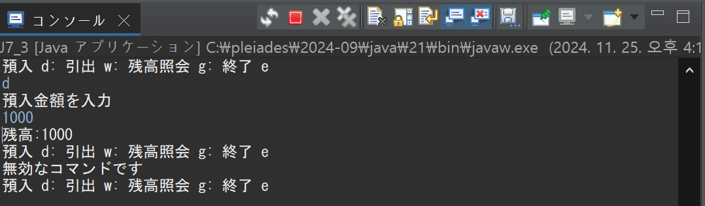

結果を見るとわかるように、ユーザーは1000を入力したのに1000が入力されて「無効なコマンドです」が出力されることが分かる。

この理由としては1000は整数として認識され正しく銀行に保存されている。しかし、1000の次にEnterが1000が預入された後の次の行動のコマンドとして入力されているからである。

よって、`scanner.nextLine();`を入れることで1000EnterのEnterを消すために次のラインに移動するコードを追加することである。

このように計算的にできないエラーの処理以外にも思った通りに動かないエラーも確実に処理する必要がある。

## 課題4
### プログラムの説明
コマンドライン引数で完全修飾クラス名を受け取り、そのクラスが持つスーパークラスの数を計算して表示するプログラムである。プログラムでは、クラス名をもとに Class.forName() メソッドを使用してクラス情報を取得し、getSuperclass() メソッドを用いて継承階層を辿り、スーパークラスの数をカウントする。

また、以下のような例外を適切に処理する。

1. コマンドライン引数がない場合、ArrayIndexOutOfBoundsException を捕捉し、「引数がありません」というエラーメッセージを表示する。
2. 無効なクラス名が指定された場合、ClassNotFoundException を捕捉し、「クラスが見つかりません」というエラーメッセージを表示する。

さらに、java.util.GregorianCalendar や java.awt.Dialog など複数のクラスでテストを行い、それぞれ異なる継承階層を持つことを確認するプログラムである。
### 実行結果
#### `java.util.GregorianCalendar`の場合
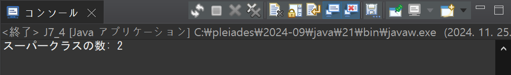
#### `java.awt.Dialog`の場合
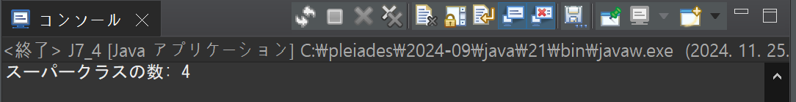
#### 引数がない場合
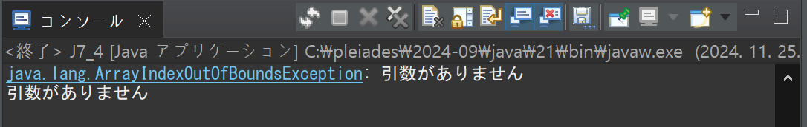
#### `abcdefg`の場合
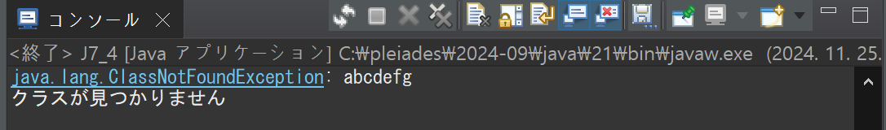

### 考察
`java.util.GregorianCalendar`と`java.awt.Dialog`のスーパークラス数を考察したいと思う。

実行結果を見るとわかるように、`java.util.GregorianCalendar`のスーパークラス２個であり、`java.awt.Dialog`はスーパークラス４個である。

GregorianCalendarクラスについて調べると、クラス java.util.Calendarから継承とクラス java.lang.Objectから継承すると書いている。

Javaでは全てのクラスがObjectクラスを継承するので必ず1個の継承は存在する。

GregorianCalendarクラスは具体的なカレンダーを具現するクラスである。

また、継承しているCalendarクラスは日付と時間データを表現するための抽象クラスである。

よって、GregorianCalendarクラスの継承関係図を見ると次のようになる。

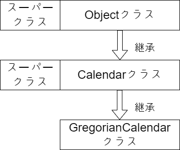

次にDialogクラスについて調べると、Dialogクラスは会話Boxを具現するクラスであり、Objectクラス、Componentクラス、Containerクラス、Windowクラスを継承している。

よって、４つのスーパークラスを継承して、関係図は次にように表現できる。

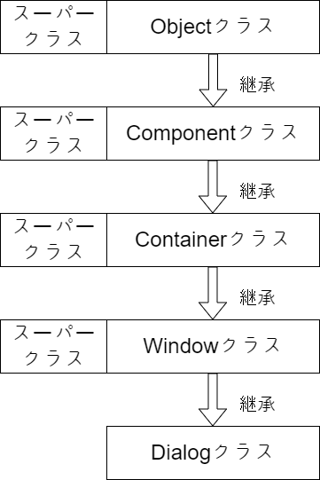

## 課題5
### プログラムの説明
課題4で行ったスーパークラスの数を計算する処理をリファクタリングし、main メソッドとは別の静的メソッドに分離するプログラムである。

この新しい静的メソッドは、完全修飾クラス名を引数として受け取り、そのクラスが持つスーパークラスの数を整数値として返す。

また、このメソッドでは、クラス名が無効な場合に発生する ClassNotFoundException を内部で処理するのではなく、throws を用いて呼び出し元である main メソッドに例外を投げるように実装する。これにより、main メソッドは例外を適切に catch してエラーメッセージを表示するプログラムである。

### 実行結果
#### `java.util.GregorianCalendar`の場合
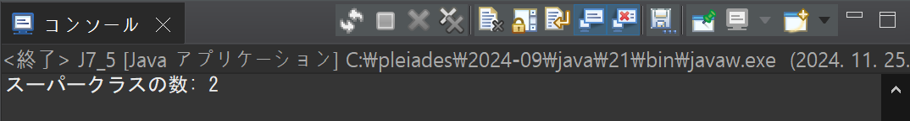
#### `java.awt.Dialog`の場合
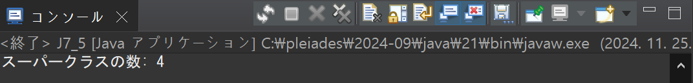
#### 引数がない場合
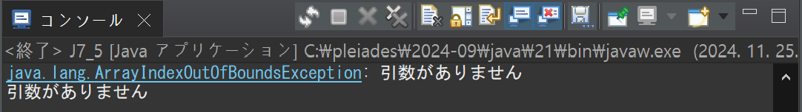
#### `Thank you`の場合
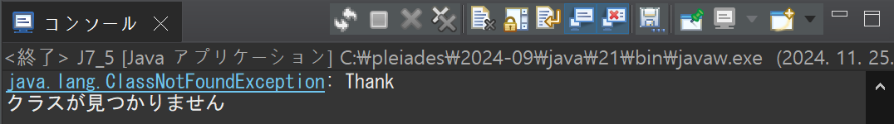
### 考察
課題４のプログラムと課題５のプログラムを比較して考察したいと思う。

課題４と課題５の違いは大きく設計方法の違いと例外処理の違いに分けられる。

#### 設計方法の違い
課題４：単一メソッド内での処理

スーパークラスの数を計算するロジックが main メソッド内に直接実装されている。

つまり、計算ロジックと例外処理の責務が main に集中しており、プログラム全体の役割が分散されていない。

課題５：メソッドの分離

スーパークラスの数を計算する部分が main メソッドとは別の静的メソッドに分離されている。

つまり、計算ロジックを分離することで、コードの可読性が向上し、再利用可能なメソッドとして汎用性が上がる。

よって、課題５のプログラムが静的メソッドとして分離され、他のクラスやメソッドから簡単に呼び出せる点と、計算ロジックと例外処理が分離されており、読みやすいコードになっている利点がある。

#### 例外処理の違い

課題４：main 内で例外処理を完結

例外（ArrayIndexOutOfBoundsException や ClassNotFoundException）の発生と処理がすべて main メソッド内で行われている。

よって、main メソッドが全ての責務を持つため、例外処理が分散されずにまとまっていますが、可読性が低下する可能性があると考えられる。

課題５：外を呼び出し元に伝播

スーパークラスの数を計算するメソッドでは ClassNotFoundException を処理せず、throws を使用して呼び出し元（main メソッド）に例外を伝播している。

従って、例外を呼び出し元で一元的に処理することで、計算メソッドは純粋に計算ロジックだけに集中できる。

#### 課題５の利点
課題4はシンプルな実装で例外処理も含めて完結しますが、課題5ではメソッドの分離と例外伝播を活用することで、コードの可読性・再利用性が向上している利点がある。

# 参考文献
Oracle「クラスGregorianCalendar」https://docs.oracle.com/javase/jp/8/docs/api/java/util/GregorianCalendar.html

Oracle「クラス Dialog」https://docs.oracle.com/javase/jp/1.5.0/api/java/awt/Dialog.html

# 謝辞
特になし。

# 感想など
例外処理であるtry&catchを理解できた。

よって、プログラムを作る際の様々な例外について考えるようになり、例外処理の重要性についてわかるようになった。
