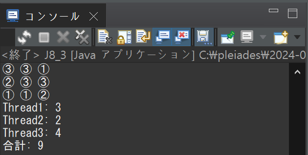

# プログラミング演習II 第08回
* 学籍番号：2364902
* 氏名：金　奎碩
* 所属：情報工学EP

# 課題の説明

## 課題1
### プログラムの説明
1から10までの整数を加算するスレッドと乗算するスレッドの2つを作成し、それらを同時に実行するものです。各スレッドは、計算ごとにスレッド名と結果を出力する。

また、Thread.sleep(1000) をループ内に挿入することで、1回の計算ごとに1秒の遅延を追加する。これにより、スレッドの実行順序や出力の間隔が異なる結果を見ることができる。

Thread.sleep(1000) を使用すると規則的な出力間隔が得られやすく、使用しない場合はスレッドのスケジューリングに依存して出力順序がランダムになる。

### 実行結果
#### `Thread.sleep(1000)`を入れなかった場合

#### `Thread.sleep(1000)`を入れた場合

### 考察
`Thread.sleep()`を入れた場合と入れなかった場合が違う結果が出た理由について考察したいと思う。

#### `Thread.sleep(1000)`を入れなかった場合
この場合スレッドが待機なく実行されるため、CPUはより多くの時間を一つのスレッドに集中することができる。

二つのスレッドがほぼ同時に実行される時と、一つのスレッドが他のスレッドより先に終わる可能性が高くなる。

よって、`Thread.sleep(1000)`を入れなかった場合の結果を見るとわかるようにAddの結果が先に完了してAddの結果が表示されてその後にMulの計算が行われて結果が表示されることが分かる。

#### `Thread.sleep(1000)`を入れた場合
各スレッドがループするたびに1秒待機することで、AddスレッドとMulスレッドが順番的に実行されることが多くなる。

つまり、出力が規則的に1秒間隔で行われている。

`Thread.sleep(1000)`を入れた場合の実行結果を見るとわかるように、二つのスレッドが交代に出力される場合が多い。

これは二つのスレッドがCPUの時間を均等に分けて使っていることが分かる。

## 課題2
### プログラムの説明
カウントを管理する Counter クラスを作成し、3つのスレッドが同時に countUp() メソッドを10,000回ずつ実行してカウントを増やすプログラムである。

各スレッドは ThreadX クラスのインスタンスとして実行され、同じ Counter オブジェクトを共有する。

countUp() メソッドに synchronized を付与することで、ス最終カウント値は 30,000 になることを確認する。

一方、synchronized を使用しない場合は、結果が 30,000 未満になることを確認するプログラムである。

プログラムは join() を用いて全スレッドの終了を待機し、その後に最終的なカウント値を出力する。
### 実行結果
#### synchronized を使用しない場合

#### synchronized を使用する場合

### 考察
synchronized を使用する場合とsynchronized を使用しない場合の違いについて詳しく考察したいと思う。

#### synchronized を使用しない場合

synchronized を使用しない場合は全てのスレッドが同時にcount値を読み取って、同時に値を更新しようとしている。

このように同時に値を更新するときに問題が生じる可能性がある。

例えば、二つのスレッドが同時に100の値を読み取ると二つのスレッドが同時にcountの値を101に更新する。

この時各スレッドが100から101に更新するときに比べて動作が重なってしまって30,000より小さい結果が得られると思う。

#### synchronized を使用する場合
synchronizedを使用するとスレッドが共有データに接近する際にロックを獲得して同時に多くのスレッドが同じデータに接近することを防ぐことができる。

よって、今回の課題ではCounterクラスのcountの共有変数を持っている。この変数を三つのスレッドが共有して使用している。

この時synchronized を使用することで一つのcountUp()を実行するときに他のスレッドを待機させることができる。

よって、synchronized を使用する場合の実行結果を見ると一つのスレッドが10,000をカウントして三つのスレッドがカウントしたので30,000の結果が得られる。

## 課題3
### プログラムの説明
複数のスレッドが共有するゲームボードに記号をランダムに配置する処理を実現するプログラムである。ボードは3×3のマス目で構成され、各スレッドが異なる記号をボード上に配置する。

プログラムは以下のように動作する。

1. まず、ボードを管理するBoardクラスでは、マス目を表す二次元配列を用いてボードの状態を管理する。このクラスには、ボードを初期化するclear()メソッド、現在のボードの内容を出力するprint()メソッド、指定された位置に記号を配置するsynchronizedなput()メソッドがある。put()メソッドは、指定された位置が空いていれば記号を配置してtrueを返し、空いていない場合はfalseを返す。

2. 次に、ComputerクラスではRunnableインターフェースを実装し、記号をランダムに配置するスレッドとして動作する。このクラスは、記号、配置した記号の数、共有するBoardオブジェクトを持っている。スレッドが実行されると、Boardのput()メソッドを呼び出して記号を配置する。ただし、連続して100回配置できない場合はスレッドを終了し、無限ループを防ぐ。

mainメソッドでは、3つのComputerオブジェクトを作成し、それぞれ異なる記号を割り当てる。これらをスレッドとして起動し、join()メソッドで全スレッドの終了を待機する。

その後、ボードの状態を出力し、各スレッドが配置した記号の数を表示する。さらに、ボード上に配置された記号の総数と各スレッドの配置数の合計が一致することを確認するプログラムである。

そして、マスのサイズ (n x n) を大きくして試す。
### 実行結果
#### n = 3の場合

#### n = 5の場合

### 考察
ここでjoin()を利用して全てのThreadの終了を確認している。

join()を利用してThreadの終了をどのように確認できるか詳しく調べたいと思う。

参考文献によるとjoinメソッドは、JavaのThreadクラスに属するメソッドで、特定のスレッドが終了するまで現在のスレッドを待機させるために使用されると言われている。これにより、スレッド間の実行順序を制御することが可能となる。

J8_3のコードではjoin()を利用することで、mainスレッドが全てのスレッド（t1,t2,t3）の処理が終了するまで待機することができる。

よって、board.print()やスレッドごとの配置数を正確に取得することが可能である。

もし、join()がない場合、mainスレッドがスレッドの終了を待たずに続行してしまうため、ボードの内容が完全に反映されない状態でprint()メソッドが呼ばれたり、各スレッドの配置数が不完全な状態で出力される可能性がある。

## 課題4
### プログラムの説明
このプログラムは、1つのスレッドで整数を生成し（Producer）、キューに書き込み、別のスレッド（Consumer）がその整数をキューから読み取る仕組みである。キューは最大10個の整数を保持でき、以下の条件を満たすように動作する。

1. #### Producerの動作:
   キューが空の場合、整数を連続して生成してキューに書き込む。キューが一杯になると、Consumerがキューを空にするまで待機する。
2. #### Consumerの動作:
   キューが一杯になるまで待機する。キューが一杯になると、キューの要素をLIFO（Last In First Out）で取り出して表示する。キューが空になると、Producerが書き込むまで待機する。
3. #### レッド間の同期:
   wait(), notify()またはnotifyAll()を使用して、ProducerとConsumer間のスレッド同期を実現。スレッドの動作速度を制御するため、Thread.sleep(1000)を挿入。
4. #### 拡張:
   Consumerスレッドを1つから3つに増やし、各スレッドが取り出した整数を表示する。同期を解除（notify()やnotifyAll()を使用しない）すると、デッドロックが発生し、プログラムが停止することを確認。
   
### 実行結果

### 考察
ここではProducerのConsumerの動作を確認して図を使って理解しようと思う。

最初にQueue配列には何も入ってない状態である。QueueがからであるためProducerが動いてQueueを全て埋める。
#### Producerの動作

このようにProducerがQueue配列を全ての入れるとwait()してnotify()またはnotifyAll()を利用してConsumerを起こす。

Consumerの動作は次のようにLIFO（Last In First Out)でQueueの配列を出力して削除する。
#### Consumerの動作

このようにConsumerが全てのQueueスタックを消費するとwait()してnotify()またはnotifyAll()を利用してProducerを起こしてQueueスタックを補充する。

このように作業が行われることが分かる。

よって、実行結果を見ると出力が逆順に出力されることが分かる。

# 参考文献
侍エンジニア編集部「【Java】joinメソッドでThreadが終了するまで待機する」https://www.sejuku.net/blog/22006
# 謝辞
特になし。

# 感想など
スレッドの動作を理解することができた。また、同期の重要性についてもわかるようになった。
