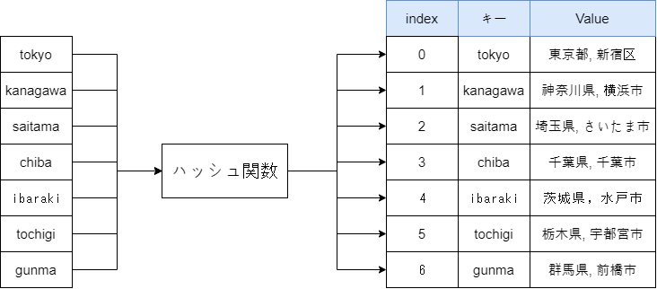

[](https://classroom.github.com/a/G1jSOuOF)
# プログラミング演習II 第09回
* 学籍番号：2364902
* 氏名：金　奎碩
* 所属：情報工学EP


# 課題の説明

## 課題1
### プログラムの説明
誕生日から現在までの経過日数を計算するプログラムである。まず、GregorianCalendarクラスを使って誕生日を設定する。月の指定は0から始まるため、1月は0、2月は1となる。例えば、誕生日が2001年2月3日の場合、GregorianCalendar(2001, 2, 3)のように設定する。

次に、Dateクラスを使って現在の日時を取得する。new Date()で現在の日時を取得することができる。誕生日と現在の日時の差を求めるために、両方のDateオブジェクトのgetTime()メソッドを使って、ミリ秒単位でその差を計算する。

その差を得たら、ミリ秒を日数に換算するために、ミリ秒数を1000 * 60 * 60 * 24で割り、この計算により、誕生日から現在までの経過日数が求めることができるプログラムである。

最後に、計算された日数を表示して結果を確認する。プログラム内で誕生日が固定されているため、ユーザーの入力は必要なく、プログラム実行時に誕生日から現在までの日数が自動的に計算される。

### 実行結果


### 考察
ここでは単純に日数の差を利用して計算することではなくミリ秒から日数を計算する理由について考察したいと思う。

また、`new GregorianCalendar (2001, 1, 3)`の部分で実際の誕生日の月は3月であるが０から始まるため1として表現する必要がある。これはコードを読む人にとって誤解を招く可能性がある。

この二つの問題点を解決するためにLocalDateクラスを利用することがより直感的で簡潔な実行結果を得ることができると思う。

また、ChronoUnitクラスの中にあるbetween()メソッドを利用することでより直感的なコードにすることができる。

よって、コードをより直感的変えると次のようになる。

```
import java.time.LocalDate;
import java.time.temporal.ChronoUnit;

public class J9_1 {
    public static void main(String[] args) {
        // 誕生日の設定 (LocalDateを使用)
        LocalDate birthDate = LocalDate.of(2001, 2, 3); // 2月3日
        
        // 現在の日付
        LocalDate currentDate = LocalDate.now();
        
        // 日数の経過を計算
        long elapsedDays = ChronoUnit.DAYS.between(birthDate, currentDate);
        
        // 結果を出力
        System.out.println("誕生日: " + birthDate);
        System.out.println("現在日時: " + currentDate);
        System.out.println("誕生日からの経過日数: " + elapsedDays + "日");
    }
}
```

このコードを利用した実行結果を見ると
#### 直感的実行結果


この実行結果を見るとより直感的に結果が得られることが分かる。

また、コードを見ても誕生日の部分がはっきりわかるので読む人が間違うことはない。

ミリ秒を使って正確な計算を行うときにはミリ秒が必要であるがこの場合のように日数だけを計算するときにはこのようなコードがより効率的だと思う。

## 課題2
### プログラムの説明
このプログラムは、ガウス分布（正規分布）に従う乱数を生成し、その分布を±3σの範囲内で表示するプログラムである。

まず、RandomクラスのnextGaussian()メソッドを使って平均が0、標準偏差が1のガウス分布に従う乱数を生成する。次に、±3σ（-3.0から3.0）の範囲に収まる乱数だけをカウントする。

乱数の値がこの範囲内に収まる場合、0.1刻みで区切った範囲にその値を振り分け、発生回数を配列に記録する。これにより、ガウス分布に従う乱数がどの範囲にどれくらいの頻度で出現するかを視覚的に確認できるようになる。

各範囲ごとの発生回数を表示するために、`*`を使ったグラフを描画する。発生回数が多い範囲では`*`が多く表示され、少ない範囲では`*`が少なくなる。最後に、±3σの範囲に収まる乱数の割合を計算し、その結果を表示する。理論的には、標準正規分布に従う乱数の99.7%は±3σの範囲に収まるため、その割合がどれくらいの値になるかを確認できるプログラムである。

### 実行結果


### 考察
ここで使われているガウス分布(正規分布)の乱数について詳しく考察したいと思う。

ガウス分布＊（正規分布）は統計学の重要な確率分布の一つで、自然現象や社会的現象によく発生する分布の形である。この分布はデータが平均値を中心に対称的に広がっている。

ガウス分布の数学的定義は次のように定義できる。

$f(x) = \frac{1}{\sigma \sqrt{2\pi}} \exp\left( - \frac{(x - \mu)^2}{2\sigma^2} \right)$

このガウス分布は次のような性質がある。
1. 平均値と最頻値と中央値が一致する
2. 平均値を中心にして左右対称である。（直線x=μに関して対称）
3. x軸が漸近線である。

この性質は実行結果の`*`の分布を見ると成立することがわかる。よって、Randomクラスの中にあるガウス分布の乱数は正規分布を成立することがわかる。

このような正規分布は日常生活でよく見られる分布であるため、日常生活の上でのデータ分析の時に重要である。

例えば、成績の分布を見るとわかるように真ん中に人々の点数が集まって中心から離れると人が少なくなる正規分布を成立する。

よって、もし人々の成績の乱数を生成するときはこのようにガウス分布の乱数を生成することがより効果的である。

Randomクラスの中にはガウス分布乱数以外にも均等分布乱数など色々ある。

## 課題3
### プログラムの説明
このプログラムは、ランダムに0から9までの異なる整数を生成し、その整数を昇順および降順で表示するプログラムである。

最初に、ArrayList<Integer>型のnumbersリストを作成します。このリストには重複しないランダムな整数を追加していきます。Randomクラスを使って、0から9までの整数を生成し、numbersリストに追加します。ランダムな数が既にリストに含まれていないことを確認するために、contains()メソッドでチェックし、含まれていない場合にのみリストに追加します。これにより、リストに重複した値が入ることを防ぎます。

numbersリストには10個の異なる整数が集まるまで、ランダムな数を生成し続けます。リストに10個の異なる値が追加された後、Collections.sort()メソッドを使ってリストを昇順にソートします。その後、拡張for文を使って昇順の整数を一つずつ表示します。

次に、Collections.reverse()メソッドを使って、リストを降順に逆転させます。再び拡張for文で降順に並べ替えられた整数を表示します。

最後に、昇順および降順に並べ替えられたリストをそれぞれ出力します。

### 実行結果


### 考察
ArrayListクラスの特徴と利点について調べたいと思う。

ArrayListクラスはJava クラスライブラリの中でも非常に重要なクラスだと言われている。

基本的に配列は大きさが固定されているため予め割り当てられている空間を超えて大きさを拡張することはできない。

しかし、ArrayListクラスを利用することで自動的に大きさを変えることができて、柔軟で効率的なデータ構造を作ることができる。

ArrayListの配列の割り当て方法は次のようになる。

1. 初期大きさ設定：ArrayListは生成者の大きさを指定しないと基本的に10個の要素を保存できる配列が割り当てられる。
2. 配列の大きさ自動拡張：ArrayListに要素を追加すると、内部の配列の大きさが自動的の調整される。もし、これ以上追加できない場合は新しい配列を生成して既存配列のデータを新しい配列にコピーする。


このような仕組みで動的割り当てが行われている。

C言語で有名な動的割り当てのmallocに比べるとmallocはC言語で直接メモリを割り当てて管理するに比べて、ArrayListはJavaの内部で自動的にメモリの大きさを拡張して管理する。

また、mallocは直接メモリを解除（free)する必要があるため、ミスが起こる可能背を含めている。

それに比べて、ArrayListは自動的に管理しているため安全的に管理することができる利点がある。

## 課題4
### プログラムの説明
このプログラムは、日本の都道府県とその県庁所在地を管理するためのプログラムである。プログラムは主に3つの部分から成り立っている。

まず、Prefectureクラスが定義されている。このクラスは都道府県名とその県庁所在地を管理するために使われている。Prefectureクラスには、都道府県名と県庁所在地をセットするためのコンストラクタと、その情報を文字列として表示するためにtoStringメソッドがオーバーライドされている。このtoStringメソッドでは、都道府県名と県庁所在地を「,」で区切って表示している。

次に、mainメソッドで、都道府県名と県庁所在地を格納した2次元配列strが定義され、これを使ってHashMapに都道府県のデータを格納している。配列strの最初の行には都道府県名が、2番目の行にはその県庁所在地が格納されている。また、strkeyという配列には、HashMapのキーとなる都道府県の名前（英語表記）が格納されている。

HashMapは、都道府県名をキーとして、対応するPrefectureオブジェクトを値として格納している。これにより、各都道府県にアクセスするための効率的な方法が提供できる。次に、prefecturesというHashMapに格納された全てのキーと値を表示する部分がある。これにより、登録された都道府県とその県庁所在地が表示することができる。

最後に、ユーザーが都道府県のキーを入力して、その情報を表示する探索機能が実装されている。Scannerクラスを使ってユーザーの入力を受け取り、入力されたキーがHashMapに存在する場合、その都道府県名と県庁所在地を表示する。もし存在しない場合は、「見つかりません」と表示される。また、「end」と入力すると、探索機能が終了するプログラムである。
   
### 実行結果


### 考察
このプログラムでは、HashMapを利用して日本の特定のキーと該当する都道府県名と都道府県庁所在地を検索するプログラムである。

ここでデータの保存と探索にHashMapを利用している。HashMapはデータ構造の中で一番最時間計算量が少ないデータ構造で有名である。

HashMapは各エントリにはキーと値が含まれているたま、よってキーを入力することそれに応じた値を得ることができる仕組みである。

例えば、コードにあるようにtokyouのキーの値を見つけるときにHashMapの代わりに線形探索を利用するとtokyoに関する都道府県名と都道府県庁所在地を配列の中で全ての比べて探索する必要がある。

しかし、HashMapを利用するとキーを利用して時間計算量O(1)で欲しい情報を見つけることができる。

ハッシュ表の作り方は次のように表現できる。



このように特定のキーをハッシュ関数に入れて固有のハッシュをもらって配列に保存される。そして、配列の中から要素を探索するときにはまた同じくキーを入力してハッシュ関数に入って出てきたハッシュを利用してValueを見つけることができる。

よって、キーについてハッシュ関数が呼び出されハッシュの値が計算されてそれに応じたインデックスを見つけるためにハッシュ衝突がない場合時間計算量はO(1)である。

これは他の探索アルゴリズムに比べて遥かに早い時間計算量である。

## 課題5
### プログラムの説明
大学の優勝回数データをファイルから読み込み、そのデータを昇順および降順にソートして表示するプログラムである。プログラムは以下の流れで動作する。

まず、Universityクラスが定義されており、各大学の名前と優勝回数を保持するためのクラスとなっている。このクラスには、大学名と優勝回数を設定するコンストラクタと、大学名と優勝回数を文字列として出力するtoStringメソッドが定義されている。

次に、MyCompクラスが定義されており、このクラスはComparatorインターフェースを実装している。このクラスでは、優勝回数に基づいてソート順を指定する比較方法を定義する。コンストラクタで与えられるmの値によってソート順が変わり、mが正の場合は昇順、負の場合は降順でソートが行われる。

mainメソッドでは、まずArrayList<University>を用意し、J9_5.txtファイルからデータを読み込む。各行には大学名と優勝回数が空白で区切られて記載されており、それぞれを適切に分割してUniversityオブジェクトを作成し、リストに追加する。ファイルが見つからない場合には例外処理でエラーメッセージを表示し、プログラムを終了する。

その後、Collections.sortメソッドを使用してリストをソートする。まずMyComp(1)を渡して昇順にソートし、結果を表示する。次にMyComp(-1)を渡して降順にソートし、その結果も表示する。ソートされたリストの内容はfor-eachループを使って順次出力される。

このプログラムでは、ファイルから読み取ったデータを動的にリストに格納し、カスタムコンパレータを使用してデータを昇順および降順にソートする機能が実現されている。優勝回数の多寡に基づく柔軟なデータ操作が可能であり、同時にファイル入出力の基本的な仕組みも示している。
   
### 実行結果


### 考察
ここでArrayListのソートの方法としてCollections.sortメソッドを使用してリストをソートしている。この課題ではCollections.sortメソッドが使用しているソートアルゴリズムが何か正確に確認したいと思う。

Javaの正式の文章では「このソートでは、入力配列がランダムに順序付けられる場合は従来のマージソートのパフォーマンスを提供しながら、入力配列が部分的にソートされている場合は必要となる比較回数が n lg(n) よりもかなり少なくなります。」と書いている。また「この実装は、Tim Peters 氏による Python 用のリストソート (TimSort) から応用されました。」の部分を見るとPython 用のリストソート (TimSort)を利用していることがわかる。

よって、TimSortがどのようなソートアルゴリズムか調べたいと思う。

Timsortは次のような特徴を持っている。

1. ラン（run)分割：入力配列をランと呼ばれる小さくソートされた部分の配列に分割する。この際に、既にソートされているとか逆順にソートされている部分を見つけて効率的にランを作る。
2. 挿入ソート使用：各ランの大きさが小さい場合、挿入ソートを利用してソートする。挿入ソートはデータが小さいときに効率的であるためである。
3. マージ(Merge)過程の最適化：分割したランをマージ(Merge)するときに特定の条件を満足するようにスタックを使用して管理してマージ順序を最適化する。
4. ギャロップ·モード(Galloping mode)：マージ過程で、片方のランの要素が連続的に多く使われるときにギャロップ·モードに転換してバイナリ探索を利用して早いマージを行う。

例えば、入力配列が`[3, 5, 7, 10, 8, 4, 2, 1]`の場合次のようにTimsortされる。


よって、Timsortはマージソートと挿入ソートの組み合わせで作られたソートである。このソートの時間計算量は最悪の場合他のソートと変わらないO(nlogn)である。しかし、既にソートされている配列とか部分的にソートされている配列は他のアルゴリズムより早く計算できる。

# 参考文献
Oracle「列挙型ChronoUnit」https://docs.oracle.com/javase/jp/8/docs/api/java/time/temporal/ChronoUnit.html　(2024-12-09閲覧）

Oracle「クラスLocalDate」
https://docs.oracle.com/javase/jp/8/docs/api/java/time/LocalDate.html　(2024-12-09閲覧）

AVILEN「正規分布の公式と特徴まとめ」https://avilen.co.jp/personal/knowledge-article/normal-distribution/

Collections (Java Platform SE 7)「クラス Collections」　https://docs.oracle.com/javase/jp/7/api/java/util/Collections.html

preferred「高速な安定ソートアルゴリズム “TimSort” の解説」　https://tech.preferred.jp/ja/blog/tim-sort/
# 謝辞
特になし。

# 感想など
色んなクラスライブラリの使い方を学ぶことができた。
