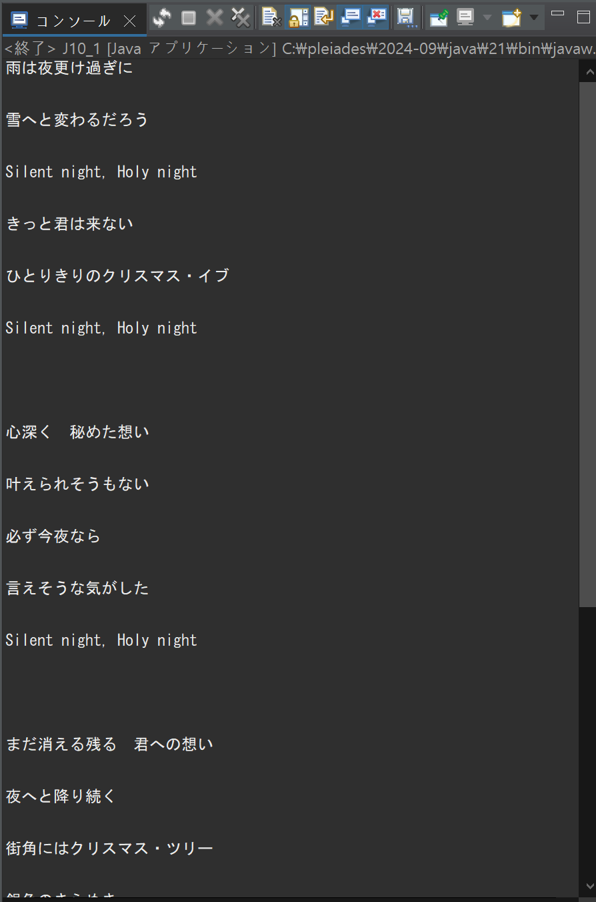
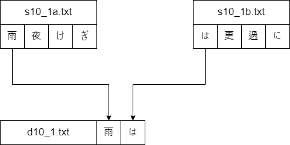
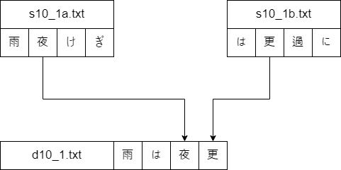
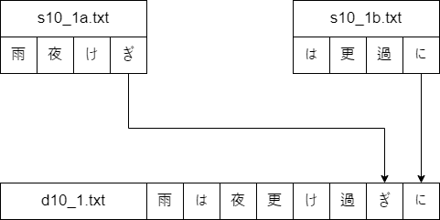
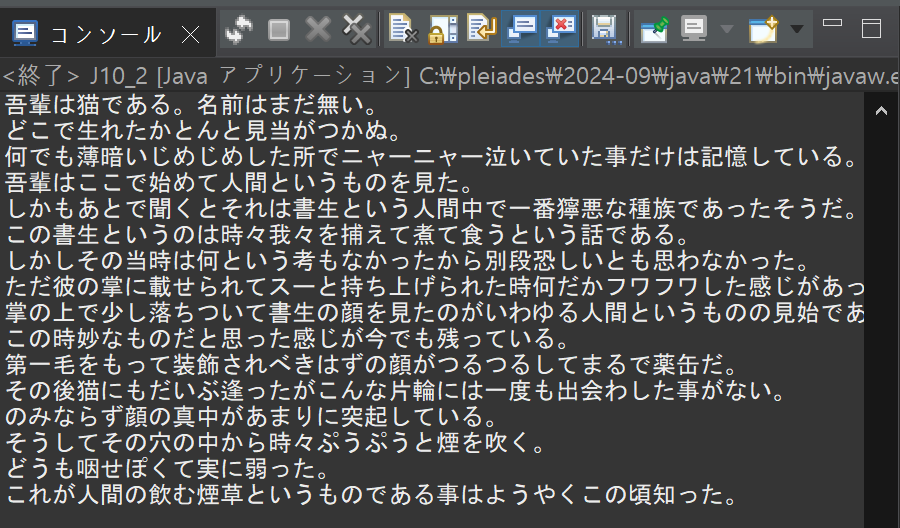
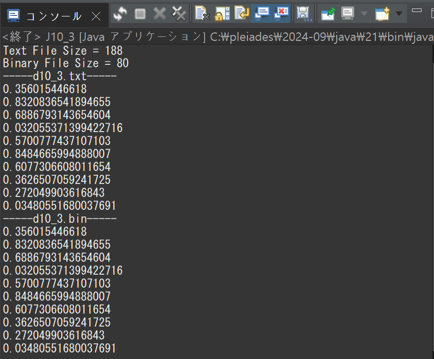
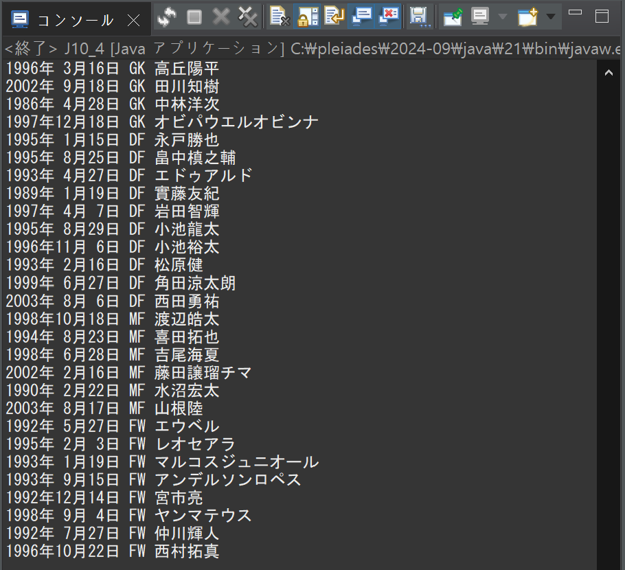
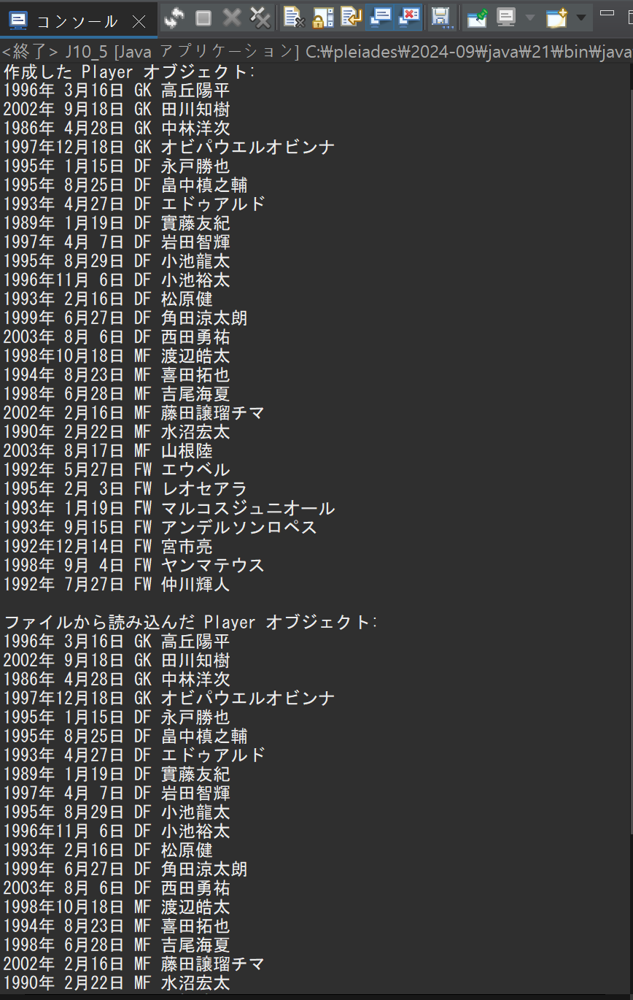

# プログラミング演習II 第10回
* 学籍番号：2364902
* 氏名：金　奎碩
* 所属：情報工学EP

# 課題の説明

## 課題1
### プログラムの説明
指定された2つの入力ファイルの内容を交互に読み込み、1つの出力ファイルに統合するプログラムである。コマンドライン引数で入力ファイル2つと出力ファイルのパスを指定する。プログラムの最初の部分では、引数の数を確認し、必要な3つのファイル名が渡されていない場合は使い方を表示して終了する。

次に、FileReaderを使って2つの入力ファイルを開き、FileWriterを使って出力ファイルに書き込みを準備する。文字ごとに交互に読み取るため、最初の入力ファイルから1文字読み取った後、それを出力ファイルに書き込み、次に2番目の入力ファイルから1文字読み取って同様に書き込みをする。どちらかのファイルが先に終了しても、もう一方のファイルの内容が全て出力されるようにループを設計する。

最後に、統合された出力ファイルの内容を確認するため、BufferedReaderを使って出力ファイルを読み取り、内容をコンソールに表示する。この部分では、行単位でデータを読み取る仕組みを使い、出力ファイル全体を順番に表示するプログラムである。

### 実行結果

### 考察
ここでは二つの`txt`ファイルから一文字ずつ読み取ってそれを`outputfile`であるd10_1.txtに保存するプログラムである。

具体的に次のような方法で保存される。

#### Step1

#### Step2

#### Step3

しかし、実行結果を見ると行の間にもう一個の空き行が存在することが分かる。

その理由として考えられるのは各ファイルの行の最後に改行文字である`\n`が存在するからだと考えられる。

上で説明したような方法で一文字ずつ読み取ると行の最後の部分で各ファイルから二つの改行文字を読み取ることになる。

よって、実行結果に改行文字が重複することが分かる。

これは簡単に考えると改行文字が出た回数を数える変数(lineBreakCount)を追加して改行文字が現れるたびに増やして重複することは1個の改行文字を2個入れることなのでlineBreakCountが偶数の時にスキップすることで解決できると思う。

## 課題2
### プログラムの説明
このプログラムは、テキストファイル「s10_2.txt」の内容を読み込み、指定された文字の条件に従って変更し、新しいファイル「d10_2.txt」に保存する処理を行うプログラムである。

まず、「s10_2.txt」を1行ずつ読み取り、各行の文字列を操作可能な形式に変換する。その後、「たた」という連続する文字列の場合は最初の「た」を削除し、次の「た」をそのまま残す。また、単独の「た」が見つかった場合はそれを削除する。

変更が終わった各行の文字列は「d10_2.txt」に書き込まれ、行ごとに改行が追加される。すべての行の処理が完了した後、保存された「d10_2.txt」の内容を再度読み込み、その変更後の内容をコンソールに出力するプログラムである。

### 実行結果

### 考察
ここでは指定されているファイルから1行ずつ読み取って処理を行っている。この際に、BufferedReaderクラスとBufferedWriterクラスを利用してファイルの読み書きを行っている。

今回の課題ではこのバッファ付き文字ストリームの利点と特徴について考察したいと思う。

「BufferedReader クラスは、テキストを1行ずつ読みこんで効率を上げるストリーム」と言われているのでテキストを1行ずつ読みこんで効率を上げていると考えられる。

バッファーを利用して効率が上がる理由はI/O作業の頻度が減る利点がある。例えば、水を運ぶときにどのようにするほうがより効率的なのかを考えるときに小さいカップを利用して水を運ぶと小さい量で行ったり来たりするのに時間が必要である。

しかし、バッファーである大きなバスケットを利用すると一回の往復でたくさんの水を運ぶことができる。

よって、ファイルを読み書きするときにも同じく毎回一文字ずつ入出力するよりバッファーに1行ずつ入れて一気に運ぶことがより効率的である。

## 課題3
### プログラムの説明
乱数を生成してテキストファイルとバイナリファイルに書き込み、それぞれのファイルサイズと内容を出力する処理を行うプログラムである。

まず、Randomクラスを使用して10個の乱数（double型）を生成する。生成した乱数はテキスト形式の「d10_3.txt」とバイナリ形式の「d10_3.bin」にそれぞれ書き込む。

テキストファイルには乱数を文字列形式で改行付きで保存し、バイナリファイルには乱数をそのままのデータ形式で保存する。この際、テキストファイルはFileWriterを使用して書き込み、バイナリファイルはDataOutputStreamを使用して書き込む。

次に、作成されたテキストファイルとバイナリファイルのファイルサイズを計算してコンソールに出力して、テキストファイルのサイズは文字列としての保存量に依存し、バイナリファイルのサイズはdouble型データが固定長（8バイト）で保存されるため、データ量が一定となる。

その後、テキストファイルとバイナリファイルの内容をそれぞれ読み取り、コンソールに出力する。テキストファイルの読み取りにはBufferedReaderを使用し、行単位でデータを取得して出力する。バイナリファイルの読み取りにはDataInputStreamを使用し、保存されたdouble型データを順次取得して出力する。バイナリファイルの読み取り中にファイルの終端に到達するとEOFExceptionがスローされるが、これをキャッチすることで読み取り処理を終了するプログラムである。

### 実行結果

### 考察
`Text`ファイルと`Binary`ファイルのサイズの違いから各ファイルの特徴と違いについて考察したいと思う。

#### テキストファイル
テキストファイルは人が読める文字データで構成されて、人が読みやすい。その特徴としては文字列の形で保存される特徴を持っている。数字や特殊文字などは文字列に変換されて保存される。よって、データの内容と形式によってサイズが変動する可能性を持っている。

#### バイナリファイル
バイナリファイルはバイナリ（2進数）データで構成されて、人が読みにくい内容を含めている。特徴としてはデータを文字列に変換する必要なくそのまま保存するので空間の節約もできる。そして、入出力が早い。

また、データが元の形式と構造を維持するため浮動小数点数のような複雑なデータ構造を的確に保存することができる。

そして、データの大きさがdouble型の8byteで固定されているため、常に同じサイズを持っている。

#### 結論
二つのファイルの特徴を見るとバイナリファイルが変換がないためサイズが小さいと考えられる。これは実行結果を見るとわかるように2倍以上の差が出ることが分かる。

つまり、人が読む可能性があるファイルの場合テキストファイルの方が可読性が優れているため向いていると考えられる。しかし、人が読むことがないデータファイルの場合テキストファイルよりバイナリファイルとして保存することがより効率的である。

また、変わらないバイナリファイルに対してプログラムを実行するたびにテキストファイルが変わる理由としては数字を文字列に変換する過程で数の桁、小数点などによって文字数が変わる。また、改行文字の追加でファイルのサイズが毎回変動する。

今回ランダム数字を利用しているため例えば、0.1の数学が出た時には文字列に変換すると3byteになる。しかし、1234.56789のような数字が出た時には10byteで保存される。

よって、数字が大きいほど、小数点以下数字が多いほどサイズは増えることである。

## 課題4
### プログラムの説明
サッカー選手の情報をテキストファイルから読み取り、各選手のデータを Player クラスのオブジェクトとして格納し、それを整った形式で表示するプログラムである。

Player クラスは、選手のポジション、名前、生年月日を保持するためのクラスで、データを整形して文字列として返す toString メソッドを備えている。プログラムのメイン部分では、テキストファイル s10_4.txt を読み込み、StreamTokenizer を使用してデータをトークンに分割して処理している。

StreamTokenizer の設定により、改行や特定の記号（カンマやスラッシュ）を区切り文字として扱いながら、選手情報を1行ずつ解析できる。各行でポジション、名前、生年月日を取得し、それらが揃った時点で新しい Player オブジェクトを作成し、ArrayList に追加する。すべての行の処理が完了した後、リストに格納された各選手の情報を順に出力するプログラムである。

   
### 実行結果

### 考察
`StreamTokenizer`クラスの特徴や利点について考察したいと思う。

#### `StreamTokenizer`特徴
`StreamTokenizer`クラスは入力ストリームをトークン（単語、数値、記号など）に分割し、1回に1つのトークンを読み取ることを可能にするクラスである。

1. ##### 多様なトークン認識
   識別子、数値、文字列、コメントなど、さまざまなトークンタイプを認識できる。
2. ##### 文字属性の設定
   各文字に対して、空白、英字、数字、引用符、コメント文字などの属性を設定できる。
3. ##### 柔軟な構文解析
   行末をトークンとして扱うか、単なる空白として無視するか、識別子の文字を自動的に小文字に変換するかなど、複数のフラグで動作を制御できる。

このような特徴を持っている。これを使って多様な入力形式を処理することができるように設計することができるできるため、複雑な文字列を分析する時に効率的である。

特に、課題４のプログラムでは`StreamTokenizer`を利用してファイルから選手の情報を読み取って、これを`Player`オブジェクトに変換している。

また、whitespaceCharsメソッドを利用して`,`と`/`を空白文字として指定し、それらを基準にトークンを分割している。

そして、行の最後終了処理をeolIsSignificant(true) の設定により、行の終了を重要なトークンとして扱い、各行ごとに選手情報を区切ることができる。

最後に、nextToken() メソッドを使って各トークンを順次読み込み、トークンの種類（TT_NUMBER、TT_WORD）に応じて年、月、日、ポジション、名前などを変数に保存することができる。

よって、`StreamTokenizer`を活用することで、構造化されたファイルデータを効率的に解析し、オブジェクトに変換することができる。

実際に、s10_4.txt の1行と2行の動きを見ると次のようなステップで分割できる。

#### `GK 1996/03/16 高丘陽平`

1. 1つ目のトークン：`GK`
   `TT_WORD`として認識される。また、ポジションに保存される。(`position = "GK"`)
3. 空白文字スキップ
  空白文字は区切り文字として無視される。
4. ２つ目のトークン：`1996`
   `TT_NUMBER`として認識される。また、年度に保存される。(`year = 1996`)

このように`/`と`,`と` `は区切り文字として残りは適切に分割できる。

## 課題5
### プログラムの説明
課題4のプログラムに新たな機能を追加し、Playerオブジェクトをファイルに保存し、その保存されたデータを再び読み込む処理を実装したプログラムである。

Playerクラスは選手情報（ポジション、名前、生年月日）を保持するためのクラスであり、Serializableインターフェースを実装している。また、シリアライズ時のバージョン管理を行うためにserialVersionUIDが設定されている。この設定により、Playerオブジェクトを安全にファイルに保存し、後で正しく読み込むことが可能になる。

プログラムの前半では、テキストファイルs10_4.txtをBufferedReaderで読み込み、StreamTokenizerを使用してファイルのデータをトークンに分割している。選手情報が一行ずつ解析され、ポジション、名前、生年月日が取得されると、Playerオブジェクトが生成され、ArrayListに格納されている。その後、リストの内容を標準出力に表示する。

追加された機能として、ArrayListに格納されたPlayerオブジェクトをファイルd10_5.objに書き出す。この処理では、FileOutputStreamとObjectOutputStreamを使用し、writeObjectメソッドでオブジェクトをファイルに保存する。

さらに、保存されたファイルd10_5.objからPlayerオブジェクトを再び読み込む処理がある。この読み込みには、FileInputStreamとObjectInputStreamを使用し、readObjectメソッドでオブジェクトを復元している。ファイルの終端に達するとEOFExceptionが発生するため、この例外をキャッチして読み込み処理を終了する。
   
### 実行結果

### 考察
ここでは`Player`オブジェクトをファイルに保存するときに`ObjectOutputStream`を利用している。`ObjectOutputStream`クラスの特徴とどのような方法で`Player`オブジェクトを保存するか考察したいと思う。

`ObjectOutputStream`クラスはJavaでオブジェクトを直列化し、出力ストリームに書き込むためのクラスである。このクラスを使用することで、オブジェクトの状態を保存したり、ネットワークを通して伝送することができる。また、`Serializable`インターフェースを実装したオブジェクトのみを直列化できる。このクラスは次のような特徴を持っている。

#### `ObjectOutputStream`の特徴
1. オブジェクトの直列化:オブジェクトをバイトストリームに変換し、ファイルに保存したりネットワーク経由で送信したりすることができる。
2. オブジェクトグラフの保存: オブジェクトが他のオブジェクトを参照している場合でも、その参照先のオブジェクトも含めて保存できます。
3. プラットフォームの独立性: 直列化されたオブジェクトは、JVMが動作するどのプラットフォームでも逆直列化（デシリアライズ）することで復元可能である。
4. データの整合性保持: オブジェクトの状態を完全に保存し、データの整合性を保証できる。

オブジェクトをバイトストリームに変換して保存することで課題３の考察で述べているようにストレージの節約と複雑なオブジェクトグラフの保存できる利点がある。

また、データサイズが小さいため、ネットワークを通して転送する際の速度が速くなると考えられる。

よって、`ObjectOutputStream`を利用したバイナリ直列化は、効率性、整合性、特にオブジェクトデータを長期的に保存したり、ネットワーク経由で転送したりする環境において非常に有用である。

# 参考文献
@b150005「【Java発展学習6日目】テキストファイルとバイナリファイルについて」　https://qiita.com/b150005/items/4fe2d5d20bb2b4911e36

Oracle「クラスObjectOutputStream」　https://docs.oracle.com/javase/jp/8/docs/api/java/io/ObjectOutputStream.html
# 謝辞
特になし。

# 感想など
テキストファイルとバイナリファイルの違いについてわかるようになった。

また、トークンを利用する`StreamTokenizer`クラスについてわかるようになった。
