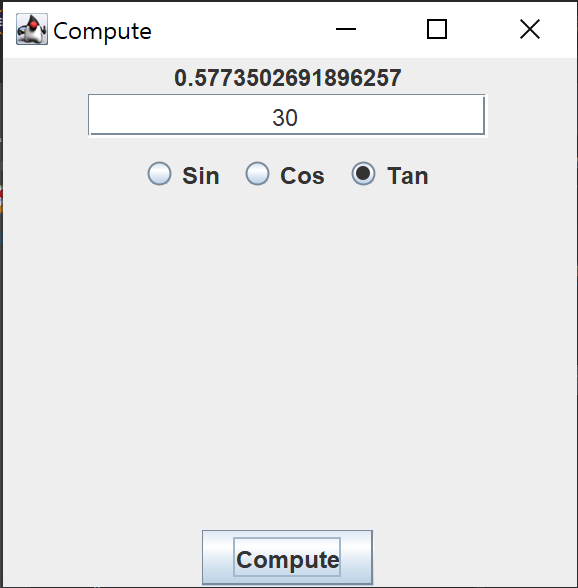
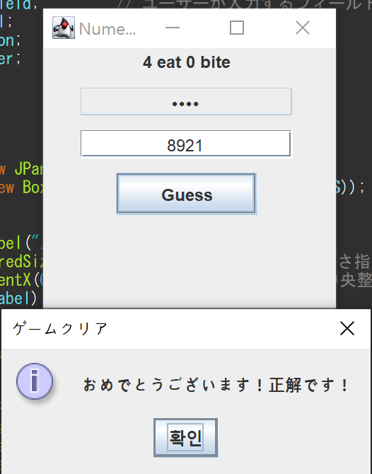
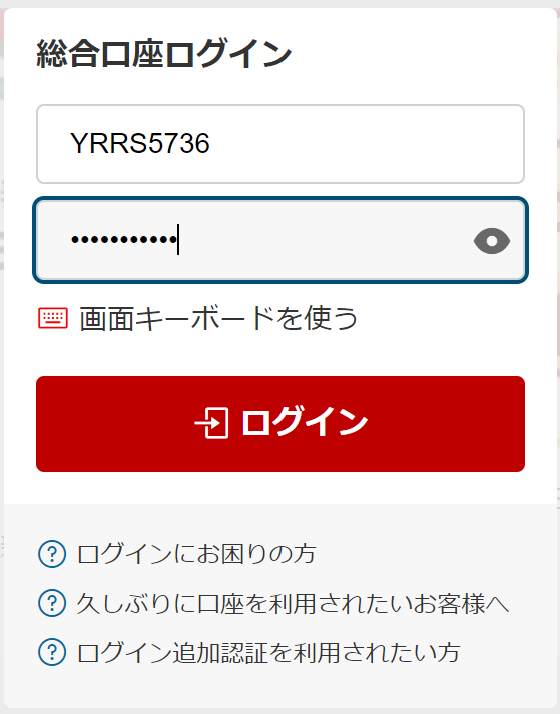

# プログラミング演習II 第11回
* 学籍番号：2364902
* 氏名：金　奎碩
* 所属：情報工学EP

# 課題の説明

## 課題1
### プログラムの説明
JavaのSwingとAWTを使用して、三角関数のグラフ（Sin曲線とCos曲線）を描画するGUIアプリケーションを作成するプログラムである。JFrameをベースに、ユーザーがボタンをクリックすることでSin曲線とCos曲線を切り替えて表示する機能を実装している。

CustomGraphCanvasクラスはCanvasを継承し、三角関数のグラフを描画する役割である。このクラスでは、paintメソッドをオーバーライドして、現在のウィンドウのサイズに応じたグラフを描画している。背景色は白色に設定し、Sin曲線は赤色、Cos曲線は青色で描画している。また、現在表示されているグラフの種類（SinまたはCos）を画面上部に表示する。

J11_1クラスはJFrameを継承し、全体の構造を定義している。このクラスでは、CustomGraphCanvasオブジェクトを中央に配置し、上部にSinとCosの2つのボタンを配置している。ボタンはJPanelに追加され、FlowLayoutを使用して横に並べている。

ボタンにはそれぞれアクションリスナーが設定されており、クリックされるとボタンのラベルに応じてCustomGraphCanvasのグラフが切り替える。この処理はactionPerformedメソッド内で実行され、repaintメソッドが呼び出されることで新しいグラフが描画されている。

プログラムの最後の部分のmainメソッドでは、J11_1クラスのインスタンスを作成してアプリケーションを起動している。

### 実行結果
#### Sin曲線

#### Cos曲線

### 考察
ここではsin関数とcos関数をCanvasに絵画する方法を確認したいと思う。

Canvasは一番左上の部分を(x,y) = (0,0)として設定されている。よって、sinとcosのyの値をそのまま入れると左上が原点であるので適切なグラフを描くことができない。

よって、Canvasの大きさの高さを２に割った部分がx軸の部分でありyの値が０の部分である。

それで、プログラムではxを0から360°まで変化するときにyの値をheight/2をしていることが分かる。また、height/2の後に`-`がある理由は普通のx,y軸はy軸が下の方向に進むと`-`になることが分かる。

しかし、Canvasの場合は下の方向に進むと`+`されるので中央であるheight/2から`-`することでx,y軸と同じ動きを再現することができる。

また、`sin`と`cos`の値(y)は`-1<y<1`であるためこの値をそのまま利用すると次のようなグラフを得ることができる。

#### 補正の前

この結果からわかるように一番大きい値である`1`は`1px`になるのでグラフがほぼ直線に見えてしまう。よって、Canvasの大きさに合わせて補正をかける必要がある。

よって、yの値に(height / 2 - 10)をかけることで補正することができる。例えば、yの値が1になったときは`height / 2 - 1*(height / 2 - 10)`となるので`-10`になることが分かる。この値は余白の値であり、x軸から一番上の部分であることが分かる。

## 課題2
### プログラムの説明
Java Swingを使用して三角関数（Sin, Cos, Tan）を計算するGUIプログラムである。ユーザーが角度を度単位で入力し、ボタンで三角関数を選択して「Compute」ボタンを押すと、結果がラベルに表示されるプログラムである。

入力角度はラジアンに変換され、Math.sin、Math.cos、Math.tanを使って計算される。無効な入力がある場合には「Invalid Input」というエラーメッセージを表示する。

### 実行結果
#### sinの場合

#### cosの場合

#### tanの場合

### 考察
ここで使用している`ActionListener`インタフェースについて考察したいと思う。

`ActionListener`は「	アクションが発生すると呼び出されます。」説明通りボタンのクリック、ラジオボタンの選択、テキストフィールドのアクションなど、ユーザーインタフェース上で発生するアクションイベントを処理するインタフェースである。

`ActionListener`を使用するとボタンクリックのようなユーザーのアクションを感知することができる。また、それに応じた動作を行うことができる。課題２ではComputeボタンをクリックすると`actionPerformed`メソッドが呼び出されて次のような動作を行う。

1. ユーザーが入力した値を読み取る。
2. 選択されたラジオボタンによって適切な三角関数を計算
3. 結果をラベルに表示

よって、今回のような一つの入力でsin,cos,tanの値を求めるときにsin,cos,tanを選択するラジオボタンとComputeボタンを使うときにはこの`ActionListener`が有効である。

## 課題3
### プログラムの説明
JavaのSwingライブラリを使用してRGB値を調整し、対応する色をリアルタイムで表示するプログラムである。ウィンドウには色を表示するキャンバスと、赤・緑・青それぞれの色成分を調整するためのスライダーが配置されている。

スライダーはそれぞれ0から255までの範囲で値を調整でき、初期値は127に設定されている。スライダーを操作すると、ChangeListenerによってキャンバスの背景色が即座に更新され、現在のRGB値が対応するラベルに表示される。キャンバスの初期色はグレー（RGB 127, 127, 127）に設定されている。

また、スライダーと対応するRGB値ラベルが1つのパネルにまとめられ、全体は3行1列のグリッドレイアウトで整理されているプログラムである。

### 実行結果
#### 結果1

#### 結果2

#### 結果3

### 考察
課題３で使われたJSlider クラスの利点や使われた理由について考察したいと思う。

JSlider クラスは説明にも書いているように「グラフィカルな手法で数値を指定する場合に利用します。 数値を直接入力する代わりにスライダーを調整することで値を指定します。 厳密な値が必要ではなく大雑把に値を調整したい場合などに便利です。」である。

よって、今回のようにRGBの値の変化によって色がどうやって変わるか確認するプログラムで適合していると思う。

また、変えた瞬間に色を確認できる利点もある。正確な数字を利用する場合は数字を入力していちいち確認する必要がある。しかし、JSliderはChangeListenerを利用してスライダーの値が変わるたびにイベントを発生させてCanvasの色をライブで変えることができる。

## 課題4
### プログラムの説明
4桁の数字を当てる「NumerOn」というゲームを実現するJavaプログラムである。JFrameを使用してGUIを構築しており、ユーザーは入力欄に4桁の数字を入力して「Guess」ボタンを押すことで、正解と比較した結果を確認できる。

プログラムの初期化時に、重複のないランダムな4桁の数字が生成され、正解は画面上で隠されている。ユーザーが数字を入力してボタンを押すと、入力した数字と正解を比較して、「位置も数字も一致した桁数(eat)」と「数字は一致したが位置が異なる桁数(bite)」を表示する。

結果が「4 eat 0 bite」になれば正解であり、ダイアログでゲームクリアを通知するプログラムである。
   
### 実行結果（当てる過程）
#### Step 1

基本的に1234を入力して情報を得る。この場合2biteなので二つの数字が存在している。

#### Step 2

二つ目の数字の2を0に変えたときにbiteが1になったので2の数字は確定的に存在している。

#### Step 3

そして、2と1の位置を入れ替えながら3を0に変えると2biteになっているので21**ではなく、3は存在しないことが分かる。

#### Step 4

次に2504を入力したときに0eat1biteなので5は存在しないことと、1を5に変えて変わったので1が確定であることが分かる。

また、0は存在しないことと4存在しないことが分かる。

#### Step 5

2と1は確定なので##21かつ3,4,5,0ではない6721を入力してみると2eatになるので##21になることが分かる。

また、67を入れたときにbiteが変わらなかったので67は存在しない。

#### Step 6

残っている数字が89なので89,98の場合しか残ってないので最後に9812を入れてみると2eat2biteであるので正解は8912になることが分かる。

#### Step 7

8912を入力して正解のウィンドウが出て正解の数字と一致することが分かる。

### 考察
ここではJPasswordField クラスを使用する理由と利点について考えたいと思う。

課題４の場合隠蔽されている数字を当てるゲームである。よって、正解の数字を`****`のように隠蔽するのに特化していると思う。

このクラスは今回のように数字当てゲームの桁数を見せるときに使われているが、日常生活の上でアカウントのログインするときにパスワードを入力するときにそのまま表示されることなく****のように隠蔽されることが分かる。

#### 例

これは楽天証券のログインサイトであり、実際にパスワードを入力すると画像のように・で表示されることが分かる。このようにしている理由はパスワードのような敏感な情報は見えないようにするセキュリティシステムであると思われる。

実際にカフェや地下鉄など公共場所でログインするときに見えてハッキングされることがあるのでこのような貴重な情報は隠蔽する必要があると思う。

よって、JPasswordFieldはセキュリティとプライバシーを高めるクラスであると考えられる。

# 参考文献
「塗りつぶし四角を描く」 http://java.k-sakabe.com/applet/fillrect.html
「MathBits.com」 https://mathbits.com/JavaBitsNotebook/Graphics/Color.html

# 謝辞
特になし。

# 感想など
Swingを使用することでより直感的なプログラムを作ることが出来て楽しいです。

また、今までは実際にどのように活用されているかわからないコードでしたが今回は実際に見られるサイトのプログラムでとても興味深い課題でした。

