
# プログラミング演習II 第12回
* 学籍番号：2364902
* 氏名：金　奎碩
* 所属：情報工学EP

# 課題の説明

## 課題1
### プログラムの説明
SwingとAWTを使用して作成されたGUIアプリケーションで、キャンバス上に円を描画し、ボタン操作によって円を移動させたり色を変更したりするプログラムである。プログラムはJFrameを拡張したクラスで構成され、主にキャンバスと操作用ボタンで構成されている。

キャンバスはカスタムクラスNewCanvasで作成され、円を描画し、円の座標や色を管理している。初期状態ではピンク色の背景に青色の円が中央に描画され、円の移動は、上下左右の矢印ボタンを使って5ピクセルずつ動かすことができ、中央ボタンを押すと円が初期位置に戻る。

キャンバス下部には青と赤の色変更ボタンが配置して、円の色を変更できる。また、ウィンドウのリサイズに対応しており、初期描画時にはキャンバスの中央に円が描かれるようになっている。

プログラムのレイアウトは、BorderLayoutを使用してボタンやキャンバスを整然と配置しており、キャンバスは北側に、操作ボタンは中央、色変更ボタンは南側に配置されている。

### 実行結果
#### 結果１
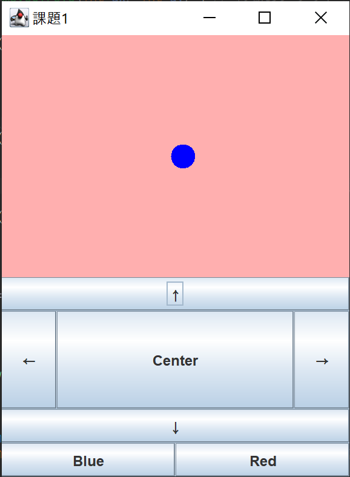
#### 結果２
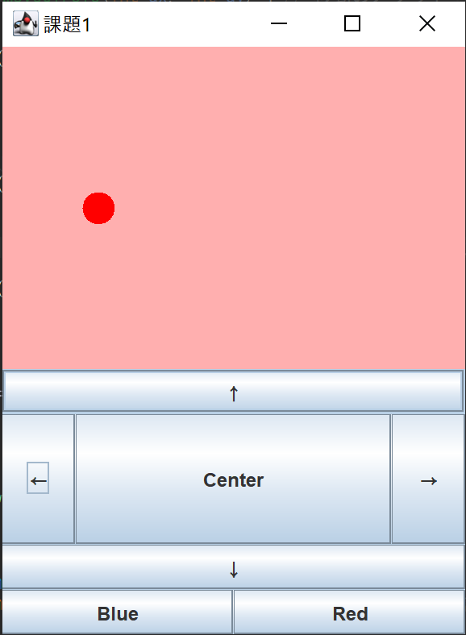
#### 結果３
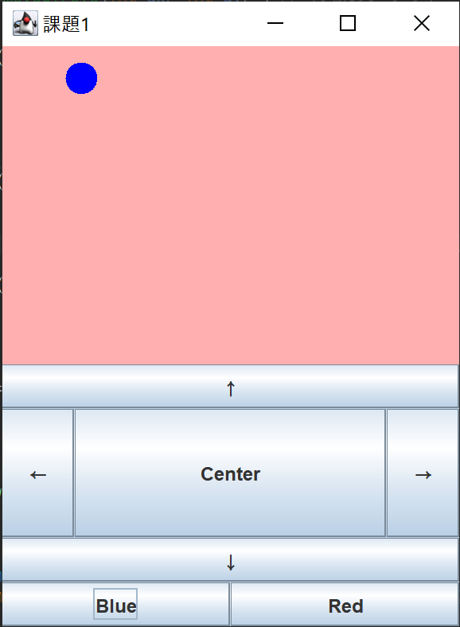

### 考察
課題１では初期ウィンドウの大きさでは問題なく作動することが分かる。しかし、ウィンドウの大きさを変えると円の位置が変わったり変な位置に移動することがある。ウィンドウを一番大きくしたときに初期位置がこのように出ることが分かる。
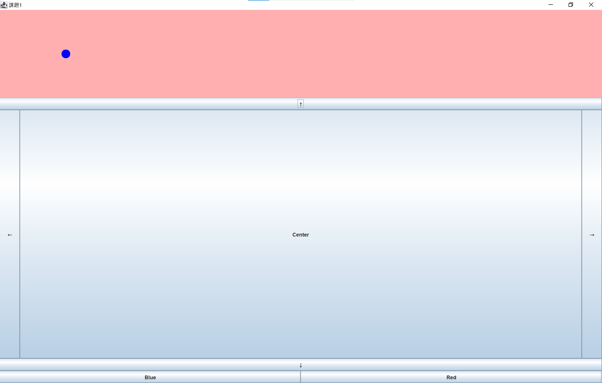
このような問題が生じる理由と解決するためにはどのようにコードを変える必要があるか考察したいと思う。

まず考えられる問題としては初期位置を(x=140, y=90)にすることでウィンドウの大きさに依存しないことで小さいCanvasの時は中央だった位置がCanvasが大きくなることで中央ではなくなると思う。

これを解決するためには初期位置と現在の位置をウィンドウの大きさによって変えることが必要である。例えば、Canvasの大きさが200X200の場合中央位置は50X50である。そして、400X400の場合は(x=100, y=100)である。
このようにCanvasの大きさを利用して中央の位置を変化させることでウィンドウの大きさによらず初期位置は常にCanvasの中央に配置されるはずである。

また、現在の位置の場合は割合を利用する必要があると思う。例えば、小さいCanvasで左に5回動いた位置にあるときウィンドウの大きさを変えると変えたウィンドウの中央から左に5回動いた位置ではなく前のウィンドウの位置に設定される。

よって、この問題はCanvasの大きさを利用して横にどのくらいの割合かつ縦にどのくらいの割合の情報を利用して絶対位置ではなく相対的位置を利用することである。

例えば、100X100のCanvasの場合40X30に位置しているときに0.4と0.3として位置情報を使うことでCanvasの大きさが500X500になった時にも500×0.4と500x0.3をしてから円を配置することで相対的位置を表現することができると思う。

## 課題2
### プログラムの説明
Swingを使用して作成されたシンプルな電卓アプリケーションである。ユーザーは数字ボタンと演算ボタンを使って計算を行うことができるプログラムである。

アプリケーションはJFrameを拡張したクラスで構成され、ラベルとボタンで操作を実現している。ラベルは現在の入力値または計算結果を表示するために使用されている。ボタンは数字（0〜9）と演算用の`+`ボタン、および計算を実行する`=`ボタンで構成されている。

ユーザーが数字ボタンを押すと、その数字がラベルに表示される。新しい演算を始めるときは、入力値をリセットし、次の入力を受け付ける。`+`ボタンを押すと、現在の入力値が最初のオペランドとして保存され、演算子として`+`が設定される。次に入力された数字は2番目のオペランドとして扱われる。

`=`ボタンを押すと、保存された2つのオペランドと演算子を使用して計算が実行され、その結果がラベルに表示される。その後、計算結果は次の演算に利用するために保存され、プログラムは再び新しい入力を受け付ける準備をする。

### 実行結果
#### 1番目の数字
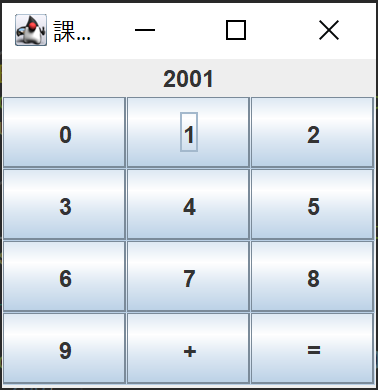
#### 2番目の数字
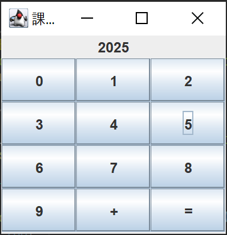
#### 結果
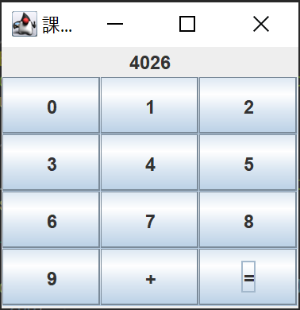

### 考察
課題の説明にも書いているように"+“, ”=“ ボタンが間違った順番で押されても対処をどのようにすれば良いのか考察したいと思う。

ここでは、`+`ボタンが押されてないときに`=`ボタンを押したときにoperator(演算子)が空の文字列になるのでcalculateResult()メソッドでoperatorが空の時は計算を行わないように条件を付けているので何も起こらない。

よって、先に`+`ボタンが押されてないときoperatorが空になるので順番が逆になっても処理可能である。

また、`+`ボタンが押されているけど2番目の数字を入力してないまま`=`を押されたときには現在ラベルに表示されている数字がsecondOperandにそのまま保存されるので1番目数字+1番目数字の計算が行われる。

また、前回の計算結果を次の計算の1番目の数字に入れることで連続した足し算の対応ができる。
計算が終わって計算結果を表示した後に`firstOperand = result;`を加えることで前回の計算結果を次の計算で利用することができる。

このような処理は積み重ねて足し算をする場合にとても効率的であると考えられる。

## 課題3
### プログラムの説明
Swingを使用して作成されたテキストエディタプログラムである。テキストの読み書き機能があり、基本的なメニュー操作が可能である。主に「開く」、「保存する」、および「終了」の機能が備わっている。

「開く」機能では、ファイルダイアログを通じてユーザーが選択したファイルを読み込み、その内容をテキストエリアに表示する。「保存する」機能では、ユーザーが指定したファイル名で現在のテキストエリアの内容を保存する。「終了」機能ではプログラムを終了する。

### 実行結果
#### 結果1
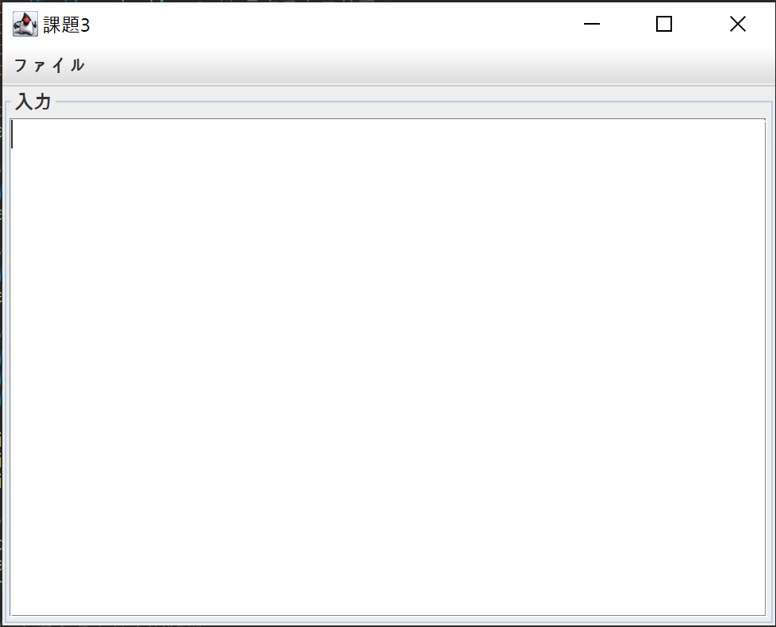
#### 結果2
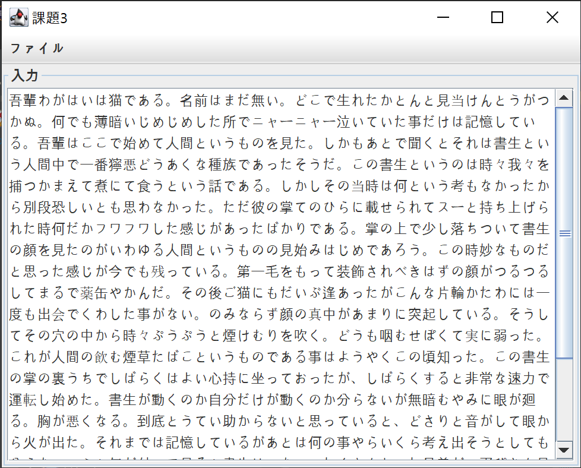
#### 結果3
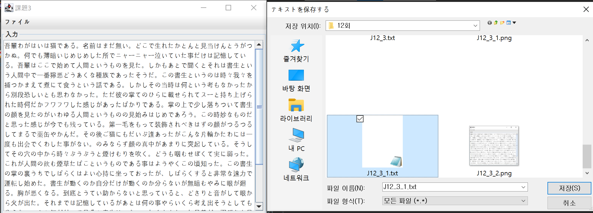

### 考察
この課題ではプログラムの改善点やより良いプログラムにする方法について考察したいと思う。

まず、このプログラムではファイルの読み書き過程が基本的システムエンコーディングを使っている。しかし、このような設定はUTF-8以外のエンコーディングを使用するときに問題が生じる可能性がある。これを解決するためにはエンコーディングを指定できるようにユーザーが選べる操作を加えることで解決できると思う。

実際に以下のような韓国語で出来ている`.txt`が存在する。
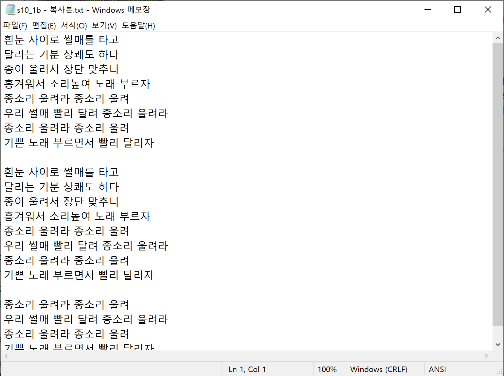
このファイルをプログラムで読み取るとき以下のような結果が得られる。
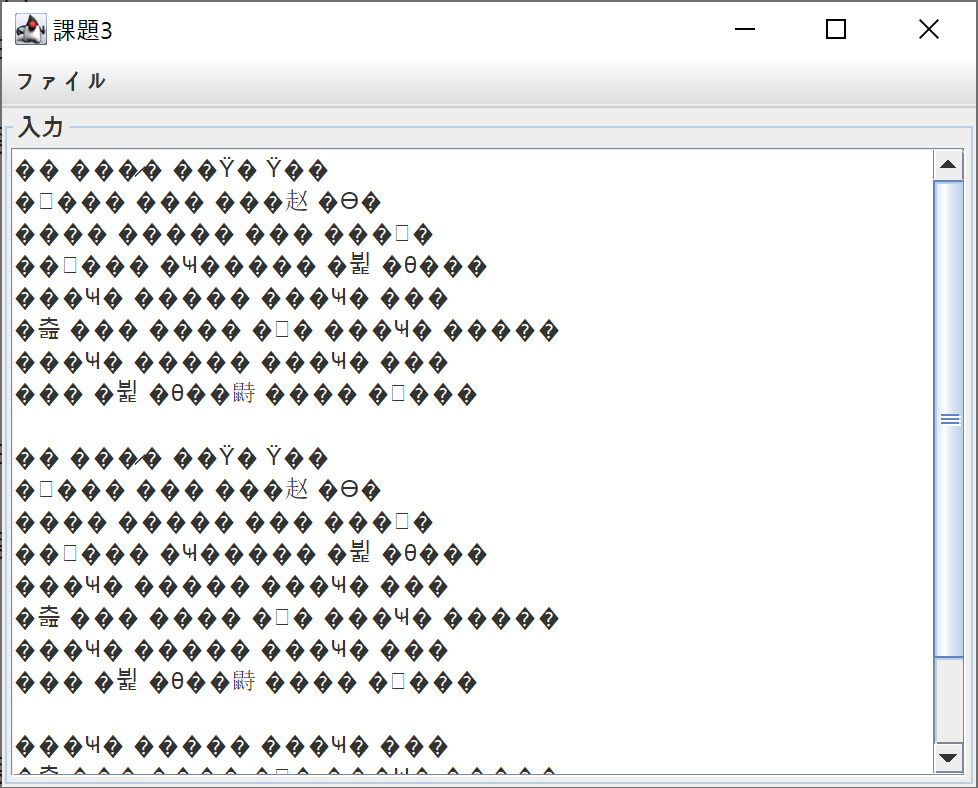
これは明らかに文字化けが起こっていることが分かる。
よって、このようにエンコーディングが固定されていると読み取れない言語が存在するのでユーザーが指定する必要があると思う。

また、ファイルを上書きするときやプログラムを終了するときに確認ウィンドウを追加するほうがよりユーザーに優しいプログラムになると思う。

例えば、間違えて上書きするときに復元できないので本当に上書きするかもう一度聞く必要があると思う。

そして、プログラムを終了する際にも保存ボタンを押すつもりだったが間違えて終了ボタンを押したときに今まで書いた内容がなくなるのでこのようなプログラムを終了するなど重要な操作はもう一度確認する必要がある。

そして、最後にこのプログラムでは基本的に`.txt`ファイルだけ処理しているが他のファイル形式も処理できるようにする必要があると思う。例えば、`.log`や`.java`のような拡張子を選択できるようにすることがより効率的でユーザーに優しいプログラムになると思う。

# 参考文献

# 謝辞
特になし。

# 感想
今回も実際に使えるプログラムを作ることでより実用的なクラスの使い方を学ぶことができた。

そして、今回の課題で他にも作ってみたいプログラムの方向性がわかるようになった。

また、ウェブサイトや実際に使っているプログラムのコードがどのように構成されているか理解できるようになった。
