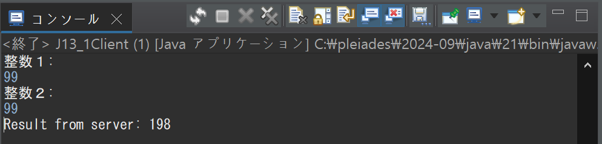
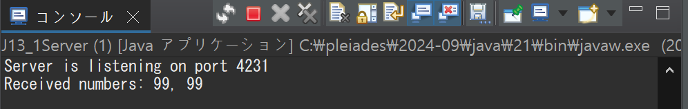
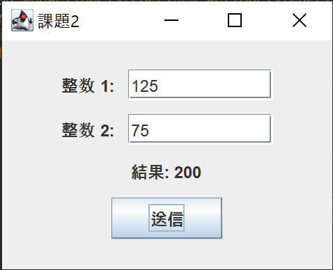
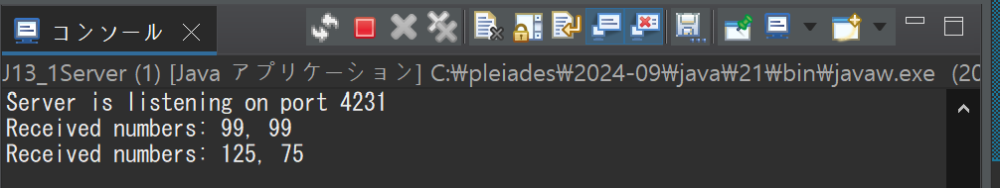
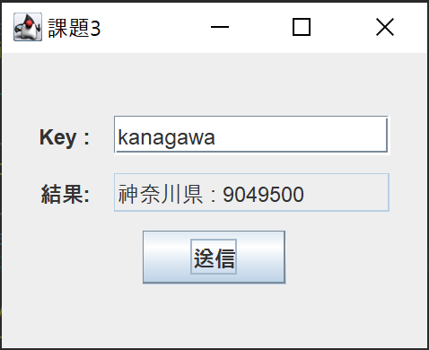
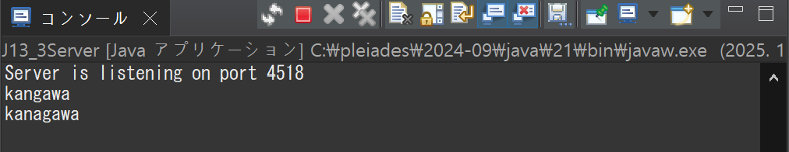
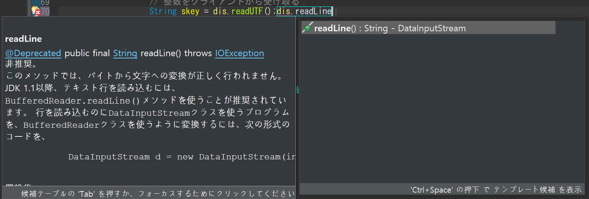
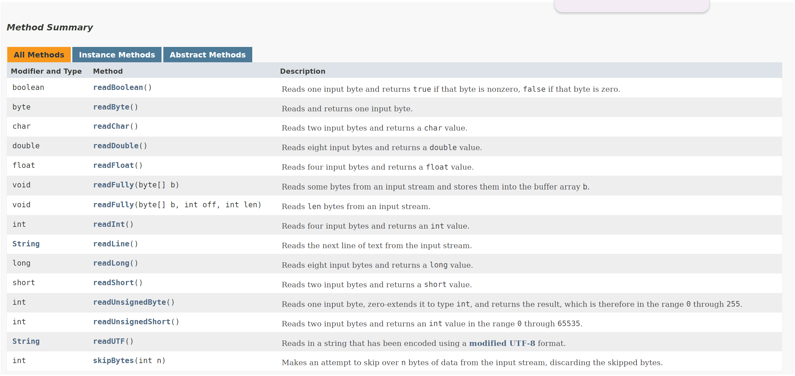

[](https://classroom.github.com/a/amUKzz5F)
# プログラミング演習II 第13回
* 学籍番号：2364902
* 氏名：金　奎碩
* 所属：情報工学EP


# 課題の説明

## 課題1
### プログラムの説明
このプログラムはクライアントとサーバー間で整数を送受信し、その合計を計算して返すプログラムである。クライアント側のプログラムでは、ユーザーが入力した2つの整数をサーバーに送信し、サーバーから計算結果を受け取って表示する。

一方、サーバー側のプログラムではクライアントから送られた整数を受け取り、それらの合計を計算してクライアントに返す。サーバーは指定したポート(4231)でクライアントからの接続を待ち受ける仕組みになっています。

### 実行結果
#### クライアント側

#### サーバ側


### 考察
ここではサーバとクライアントの間の通信ができるようにするサーバーソケットとソケットについて詳しく調べたいと思う。

まず、ソケットとは2つのマシン間の双方向通信経路の一端である。特に、ServerSoketクラスはサーバアプリケーションを作るときに使われている。クライアントからの要請を待機及び、受信するクラスである。

課題１のコードではServerSoketクラスを利用して特定のポートでサーバを開いて`accept()`メソッドを利用してクライアントからの要請を受けている。

つまり、課題１ではJ13_3Serverが特定のポート(4231)を利用してサーバを開いて`accept()`メソッドでクライアントの要請を待っている。そして、クライアントはサーバのポートに接続して出力ストリームを通して二つの整数を送る。

次に、`accept()`で待機中だったサーバが二つの整数の要請が入ったのでそれを足し算して結果をクライアントに送信する。すると、クライアントは入力ストリームを利用して計算結果を得ることができる通信システムである。

よって、この課題はサーバとクライアントの間の通信の仕方を見せてくれる。このプログラムを理解することで実際に使われているウェブサイトのサーバとのやり取りを理解することができると思う。


## 課題2
### プログラムの説明
2つの整数を入力し、それらを課題１のサーバーに送信して結果を受信するプログラムである。JFrameを拡張したウィンドウを作成し、ユーザーが整数を入力するためのテキストフィールド、計算結果を表示するラベル、そしてデータ送信を行うボタンが配置されている。

ユーザーが2つの整数を入力し「送信」ボタンを押すと、プログラムは指定されたホストとポートのサーバーに接続する。入力された整数はDataOutputStreamを通じてサーバーに送信され、サーバーから受け取った計算結果をDataInputStreamを通じて取得する。その結果はラベルに表示する。エラーが発生した場合は、その内容をラベルに表示する。

### 実行結果
#### クライアント側

#### サーバ側


### 考察
この課題は課題1 のクライアント部分を JFrame と JTextField, JButton, JLabel を使ったものに書き換えたプログラムである。

課題１と考察はあまり変わらないのでJavaのソケットで利用しているTCP/IP通信について詳しく調べたいと思う。また、TCP/IPとUDP通信の違いについても考察したいと思う。

#### TCP/IPとは
TCP/IPは次のように説明している。「TCP/IPとは、インターネットを含む多くのコンピュータネットワークにおいて、世界標準的に利用されている通信プロトコルのことです。」

特に、この通信プロトコルはハードウェアや運営体制が違っても統一された規則を使うことで円滑に通信できるようにする。TCP/IPのTCPはデータ送信の信頼性を保証する。また、IPはIPアドレスを利用して通信相手を指定して呼び出す役割をしている。

TCP/IPの階層は以下のように4つに構成されている。
1. 	ネットワークインターフェイス層
2. インターネット層
3. トランスポート層
4. アプリケーション層

#### UDPとは
UDPとはユーザーデータグラムプロトコル（UDP）として次のように説明している。「インターネット上で、動画の再生や、DNSのルックアップなど、特に時間を重視した通信に使用される通信プロトコルです。」

特に、UDPはデータ転送前に正式な接続の確立をしないので通信はとても早いが伝送中にデータパケット損失やDDos攻撃に弱い点がある。

UDPの動作原理は以下のように行われている。
* データを送る前に繋がりの設定やパケットの順序を保証しない。
* データが正確に到着したのか確認せず、データをすぐ伝送する。
* UDPで伝送されたパケットを「データグラム」と呼ばれている。

#### TCPとUDPの違い
TCPとUDPはそれぞれ利点を持っている。

TCPの場合はしっかりつながっているかを確認することでより信頼できる通信を行っている。このような通信は主にe-mailやファイル伝送の時に使われている。

常に、パケットが正しく受信されているか確認して正しいアドレスに繋がっているかを確認する。

それに比べて、UDPは送ることを重要に考えているプロトコルである。データの伝送速度がTCPに比べて早い利点を持っている。

よって、UDPは受信側が特定ではないストリーミングとかオンラインゲームとかによく使われている。

今回の課題の場合正確なサーバに二つの整数を送るので不特定多数に送るUDPよりTCPの方がより向いているプロトコルであると考えられる。

## 課題3
### プログラムの説明
都道府県の名前と人口情報を含む簡易なサーバーとクライアントの通信システムのプログラムである。サーバー側プログラムは、都道府県の名前と対応する人口データを保持し、クライアントから送信されたキーをもとに対応するデータを検索し、結果をクライアントに返す。クライアント側プログラムは、GUIを通じてキーを入力し、サーバーに問い合わせて結果を表示する。

サーバーはHashMapを使用して都道府県データを格納し、指定されたポートで待ち受けるソケット通信を利用してクライアントからのリクエストを受信する。クライアントが送信したキーに対応するデータが見つかれば、それをPrefectureオブジェクトとして返し、見つからなければ「該当なし」として返す。

クライアントはSwingを利用してGUIを構築して、入力欄にキーを入力して送信ボタンを押すと、サーバーにリクエストを送信する。サーバーから返ってきた結果は画面上に表示する。

### 実行結果
#### クライアント側

#### サーバ側


### 考察
この課題では`J13_3Ref.java`のコードをそのまま使うときにエラーが生じる。

`J13_3Ref.java`コードをよく見るとPrefectureクラスを以下のように宣言している。
```
class Prefecture {  
        private String pref;  
        private int population;

        Prefecture(String pref, int population) {  
                this.pref = pref;  
                this.population = population;  
        }

        public String toString() {  
                return pref + " : " + population;  
        }
}
```
しかし、解説にも書いているように「オブジェクトの書き込み処理を行う場合、読み込み処理に備えオブジェクトを一連のつながりのあるデータとして書き込む必要があるためで、読み込む際は書き込まれた一連のデータの順に読み込み処理を行います。」のようにオブジェクトの書き込み処理を行う際にはシリアライズ（直列化）の処理が必要である。

よって、実際にオブジェクトを使うときには以下のようにシリアライズ（直列化）を加えることが重要である。
```
class Prefecture implements Serializable {  
    private static final long serialVersionUID = 1L; // オブジェクトのクラスはSerializableインタフェースを実装
    private String pref;  
    private int population;

    Prefecture(String pref, int population) {  
        this.pref = pref;  
        this.population = population;  
    }

    @Override
    public String toString() {  
        return pref + " : " + population;  
    }
}
```

また、今回の課題のコードを作成する中で`dis.readUTF()`を入力する際にJAVAからおすすめのコードとして`dis.readLine()`ガStringを扱うときに使われるメソッドのように見えた。
#### readLine()


よって、`readUTF()`メソッドと`readLine()`メソッドの違いについて調べたいと思う。

以下のJAVAで書いているreadメソッドの説明を見ると
#### Oracleの説明


この文章を確認するとModifier and TypeがStringであるメソッドは`readLine()`と`readUTF()`が存在する。その説明を見ると`readUTF()`はUTF-8形式を利用して文字列を読み取ると書いている。そして、`readLine()`の場合入力ストリームから一つのlineを読み取ると書いている。

そして、`readLine()`の場合はバッファーを利用して一つの文字列を読み取るメソッドであるため、BufferedReaderクラスが必要である。

つまり、今回のようにDataInputStreamクラスを使っていて、日本語のようなUTF-8形式で表現できる文字を使っているため`readUTF()`を使用していると考えられる。また、`readLine()`を利用して読み取ることも不可能ではない。

# 参考文献
アイティーエム「TCP/IPとは？通信プロトコルの階層モデルを図解で解説」 https://www.itmanage.co.jp/column/tcp-ip-protocol/ (2025-01-17閲覧）

Cloudflare「UDPとは？」 https://www.cloudflare.com/ja-jp/learning/ddos/glossary/user-datagram-protocol-udp/ (2025-01-17閲覧)

Oracle「Interface DataInput」 https://docs.oracle.com/javase/9/docs/api/java/io/DataInput.html
# 謝辞
特になし。

# 感想
クライアントとサーバ間の通信の仕組みを理解することができた。

また、TCPとUDPの違いについて理解が深まった。
