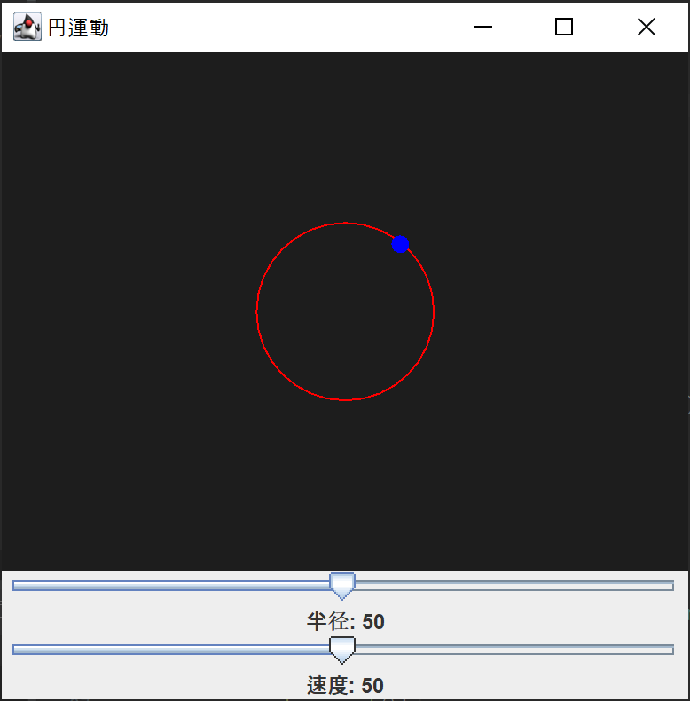
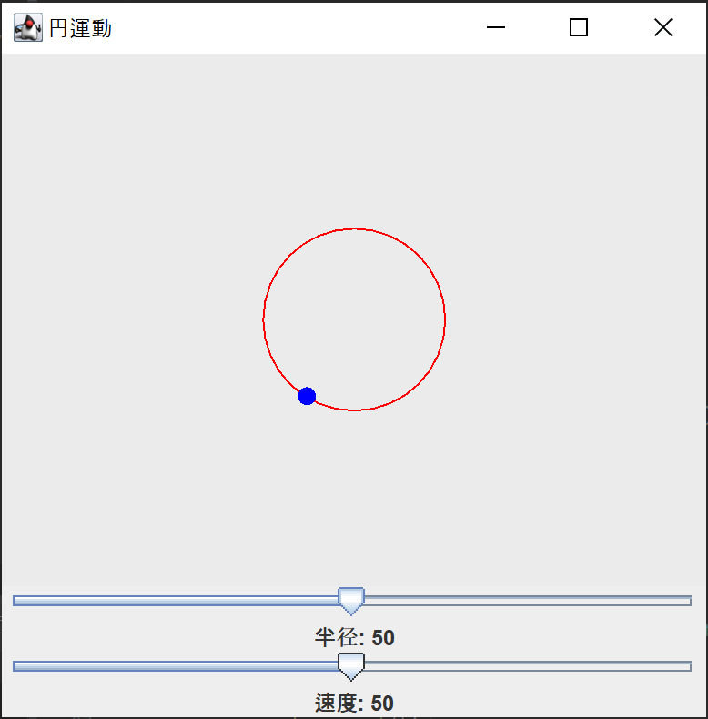
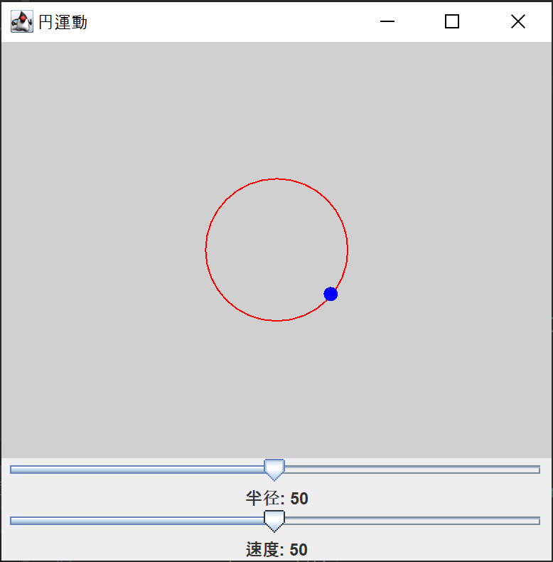
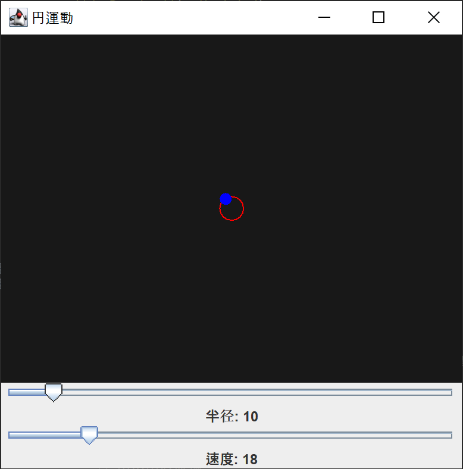
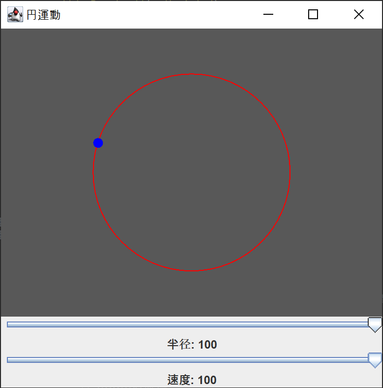
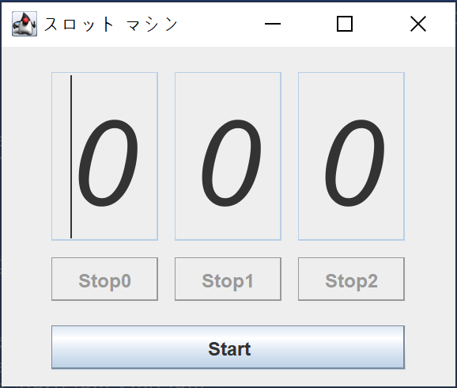
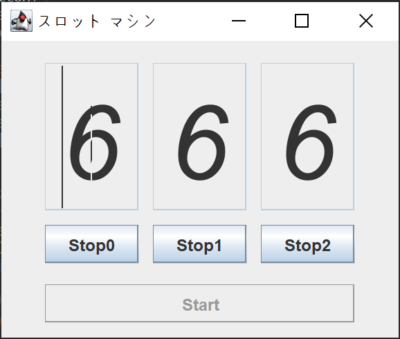
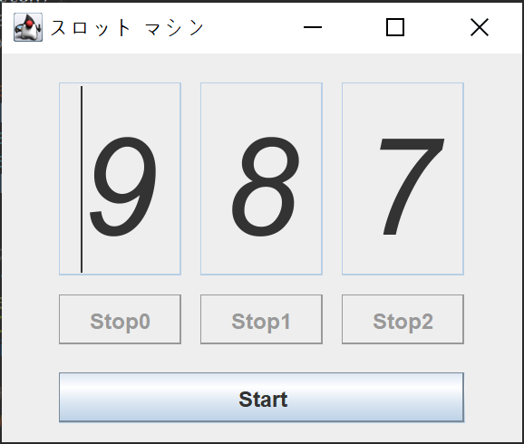

[](https://classroom.github.com/a/W9hNoc1S)
# プログラミング演習II 第14回
* 学籍番号：2364902
* 氏名：金　奎碩
* 所属：情報工学EP


# 課題の説明

## 課題1
### プログラムの説明
円運動を視覚的に表現するJava Swingプログラムである。ウィンドウには、赤い円とその円周上を青い点が移動する描画パネルが表示し、ユーザーは半径と速度を調整するためのスライダーを使用する。

描画パネルでは、赤い円の中心を基準に青い点が円周上を回転する。この点の位置は、角度と半径によって計算され、Timerによって一定時間ごとに再描画される。角度が変化することで青い点が動いているように見える。

スライダーは半径と速度を動的に調整するためのものであり、半径スライダーは円の大きさを変更し、速度スライダーは点が回転する速さを変更させる。速度変更はTimerの間隔に影響を与え、より速い回転や遅い回転を可能にする。

また、円運動に合わせて動的に変化する。具体的には、背景の色は青い点の現在の位置（角度）に基づいて計算され、Math.sin関数を使用して角度に応じた値を生成し、その値を利用してグレーの色調（RGBが同じ値）を設定する。

### 実行結果
#### 結果１

#### 結果２

#### 結果３

#### 結果４

#### 結果５


### 考察
ここでは円運動の表現方法と位置の変化によって変わるCanvas色の仕組みについて考察したいと思う。また、ダブルバッファリングについて詳しく調べたいと思う。

#### 動作の仕組み
円運動の基本である三角関数を利用して円運動を表現している。

特に、コードでは
```
int x = centerX + (int) (radius * Math.cos(angle));
int y = centerY + (int) (radius * Math.sin(angle));
```
のように円の中心を`(centerX, centerY)`と現在の角度を`angle`とおいて計算している。

よって、ここで求められた座標を使用して円運動方程式を作っている。

そして、角度をタイマーによって少しずつ増加することで円運動を表現している。

```
angle += Math.PI / 50;
```
このようにフレームごとに`Math.PI / 50`度移動することでアニメーションみたいに自然な円運動を表現することができた。

#### ダブルバッファリング
ダブルバッファリングとは、「描画に時間のかかる場合にその途中経緯が見えて画像更新にちらつきが生じるのを回避する技術で、裏のウィンドウを作成しそこへ描画しておき、drawImage()で表ウィンドウに表示してちらつきを改善します。」と書いているように課題１で円の軌跡に沿って動く点のアニメーションを柔らかく表現するために使用できる。

具体的なダブルバッファリングの仕組みは名前通りに二つのバッファリングを利用して滑らかな動きを表現する方法である。

一般的な方法では`Graphics`オブジェクトを利用して画面に直接描く方法を使っている。しかし、この方法では作業の途中の過程がユーザーにそのまま見えてしまい、画面のちらつき(flickering)が生じる。

それに比べて、ダブルバッファリングは作業をバックバッファで予め行って完成されたイメージを画面に表示するため作業の途中の過程がユーザーに魅せられることなく画面のちらつき(flickering)を防ぐことができる。

具体的に課題１の中では次のステップを通してダブルバッファリングを使用している。
1. バッファイメージの初期化
```
if (bufferImage == null) {
    bufferImage = createImage(getWidth(), getHeight());
    bufferGraphics = bufferImage.getGraphics();
}
```
2. 描画処理をバッファに行う
```
bufferGraphics.setColor(new Color(c, c, c));
for (int i = 0; i < size.width; i++) {
    bufferGraphics.drawLine(i, 0, i, size.height - 1);
}
```
3. バッファの内容を画面に描画
```
g.drawImage(bufferImage, 0, 0, this);
```

このように`bufferImage`と言う臨時バッファとしてイメージを初期化して`bufferGraphics`を使用して臨時バッファを描いて`bufferImage`に描く。

そして、最後にそれをコピーしてちらつきなく出力することができる。

## 課題2
### プログラムの説明
こシンプルなスロットマシンを模倣したJava Swingを使ったGUIプログラムである。3つのスロットを持ち、それぞれのスロットは数字をランダムに回転表示する。ユーザーは「Start」ボタンを押すことでスロットを開始し、各スロットごとに「Stop」ボタンを押して回転を停止する。

GUIはGridBagLayoutを使用して配置され、各スロットにはフォントやサイズが設定されている。スロットの数字はJTextFieldで表示され、編集不可能な状態に設定されている。スロットの動作はSlotThreadというスレッドによって実行され、ランダムな数字を一定間隔で表示する。

「Start」ボタンを押すと、全てのスロットが回転を開始し、スロットごとの「Stop」ボタンが有効になる。「Stop」ボタンを押すと対応するスロットのスレッドが停止し、すべてのスロットが停止すると「Start」ボタンが再び有効になる。この動作により、シンプルなスロットマシンの動作を実現するプログラムである。

### 実行結果
#### 初期状態

#### 回転中

#### オールストップ


### 考察
ここで`Start`ボタンの活性化を管理する`setEnabled()`メソッドの役割や利点について考えたいと思う。

また、課題２のプログラムで使われた動作の仕組みを詳しく調べたいと思う。

#### `setEnabled()`メソッド
`setEnabled()`メソッドとは「JButton や JTextField、JSlider などのコンポーネントを有効、無効にするメソッド」と言われている。

つまり、Java Swingコンポーネントの活性化を制御することに使用している。これを利用してボタンの活性化状態を動的に変更することでスロットマシンの流れを制御している。

特に、`Start`ボタンをクリックした後に`setEnabled(false)`として即非活性化する。そして、全ての`Stop`ボタンが押されたときには`setEnabled(true)`として`Start`ボタンを再び活性化する役割をしている。

よって、このようなメソッドを使うことでユーザーが特定の作業を完了する前に他の作業を制限することができる。このような制限は意図しない動作を事前に防ぐことができる。

例えば、ユーザーがスロットが回っている間は`Start`ボタンを押さないでしょうって考えて活性化したままにすると開発者の意図してないエラーや誤作動が起こる可能性がある。

#### 動作の仕組み
`Thread.sleep(100)`を利用して0.1秒で変わるように設定している。また、`currentNumber = (currentNumber + 1) % 10;`を利用して現在の数字から１を増加しながら10で割ることで9の次は０になるように設定している。

そして、`SlotThread`クラスを利用して各スロットを制御している。`Start`ボタンを押すと`StartAction`クラスの`actionPerformed`メソッドが実行されて`Start`ボタンを非活性化して各スロットの`SlotThread`インスタンスを生成して、`SlotThread`の`start()`メソッドを呼び出してスレッドを実行する。

そして、`SlotThread`クラスの`run()`メソッドが実行されて数字を変更する。

このように3個のスロットに対して3個のスレッドを独立に実行することで各スロットを独立的に操作することができる。

つまり、課題２のように3個の数字を独立的に止まらせるスロットマシンであるためスレッドを利用して制御することが効率的である。例えば、目玉焼きとチャーハンと鍋料理を三つの手を利用して同時に料理することである。

# 参考文献
tani4「Java　スロットゲーム」 https://qiita.com/tani4/items/a6a221ae64bbbbeb34a4?utm_source=chatgpt.com (2025-01-21閲覧)

Yasusi Saito「Javaで超チープなスロットマシン(最終回)」 https://ameblo.jp/ybsaito/entry-12275051328.html?utm_source=chatgpt.com (2025-01-21閲覧)
# 謝辞
特になし。

# 感想
ダブルバッファリングを利用して滑らかな画面転換の仕方を身に付けることができた。

また、ダブルバッファリングの仕組みを詳しく調べることで理解が深まった。

setEnabled()メソッドを利用してボタンなどを制御する方法が理解できた。そして、スレッドの使い方も慣れるようになった。
